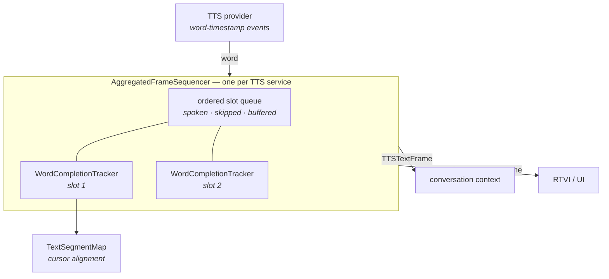

# TTS Word Tracking Architecture

How Pipecat keeps three versions of the same sentence in sync while a TTS service
speaks it, word by word.

- [TextSegmentMap](./text-segment-map.md) — aligns the three texts
- [WordCompletionTracker](./word-completion-tracker.md) — tracks one frame to completion
- [AggregatedFrameSequencer](./aggregated-frame-sequencer.md) — orders frames downstream

## The underlying problem

By the time a sentence reaches a TTS provider, it exists in three different forms:

| Channel              | Example                                     | Who consumes it            |
| -------------------- | ------------------------------------------- | -------------------------- |
| **LLM text**         | `Your card is <card>4111 1111</card>`        | The conversation context   |
| **User-facing text** | `Your card is 4111 1111`                     | RTVI clients / the UI      |
| **TTS text**         | `Your card is <spell>4111 1111</spell>`      | The TTS provider           |

They diverge because text filters and voice-formatting transforms rewrite the text on
its way to synthesis: `$42.50` becomes `forty two dollars and fifty cents`, markdown is
stripped, SSML tags are added, pattern delimiters are removed.

The provider then streams back word-timestamp events containing only what it actually
spoke — `forty`, `two`, `dollars` — with no indication of which part of the original
sentence each word came from. Pipecat has to answer three questions for every one of
those events:

1. **Where are we?** — which position in the user-facing text does this word correspond
   to, so the UI can highlight spoken text as it is heard?
2. **What do we record?** — which span of the *LLM* text does this word represent, so the
   conversation context stores `$42.50` rather than `forty two dollars and fifty cents`?
3. **When do we push it?** — in what order do word frames, non-spoken frames (code
   blocks), and sentence frames reach the rest of the pipeline?

Each layer answers one of those questions.

## The three layers



Each layer owns exactly one concern, and the layer below it knows nothing about the layer
above:

| Layer                       | Scope             | Question it answers                                       |
| --------------------------- | ----------------- | --------------------------------------------------------- |
| `TextSegmentMap`            | One sentence      | Where in the original text are we, given this spoken word? |
| `WordCompletionTracker`     | One frame         | Is this frame fully spoken, and what text does this word represent? |
| `AggregatedFrameSequencer`  | The whole turn    | In what order do frames leave the TTS service?             |

### Why each one exists

- **`TextSegmentMap`** exists because the text sent to TTS is not the text the user sees
  or the LLM wrote, so something has to hold three cursors in alignment across transforms
  and markup while matching noisy, provider-specific word tokens.

- **`WordCompletionTracker`** exists because one aggregated frame needs a completion
  verdict and an attributed span per word even when the provider misbehaves — dropped
  timestamp events, tokens straddling a frame boundary — which is policy the pure
  alignment map deliberately does not own.

- **`AggregatedFrameSequencer`** exists because words arrive per-frame but the
  conversation context is global and ordered, so spoken, skipped, buffered, and
  concurrently-live-context frames must be serialized into one correct downstream
  timeline.

## Where they are wired up

All three are driven from `TTSService` (`src/pipecat/services/tts_service.py`). The
service owns a single `AggregatedFrameSequencer`; the sequencer builds a
`WordCompletionTracker` per slot; each tracker builds one `TextSegmentMap`.

| `TTSService` calls              | Sequencer method          | When                                     |
| ------------------------------- | ------------------------- | ---------------------------------------- |
| `_push_tts_frames`              | `register_spoken`         | A frame is dispatched to the TTS         |
| `_push_tts_frames`              | `register_skipped`        | A frame bypasses TTS (e.g. a code block) |
| `_process_word_timestamps`      | `process_word`            | A word-timestamp event arrives           |
| `_apply_force_complete`         | `force_complete`          | An audio context ends                    |
| end of text input               | `finalize`                | No more tokens for this context          |
| interruption                    | `clear`                   | The turn is cancelled                    |

## Tests

| File                                    | Tests | Covers                                        |
| --------------------------------------- | ----: | --------------------------------------------- |
| `tests/test_text_segment_map.py`        |    52 | Alignment, markup helpers, hop classification  |
| `tests/test_word_completion_tracker.py` |   199 | Completion, attribution, provider quirks       |
| `tests/test_aggregated_frame_sequencer.py` | 134 | Slot ordering, streaming, concurrent contexts  |
| `tests/test_tts_frame_ordering.py`      |    46 | End-to-end frame order through real services   |
| `tests/test_cartesia_tts.py`            |    13 | Cartesia word-timestamp shapes                 |
| `tests/test_soniox_tts.py`              |    11 | Soniox word-timestamp shapes                   |

```bash
uv run pytest tests/test_text_segment_map.py tests/test_word_completion_tracker.py \
  tests/test_aggregated_frame_sequencer.py tests/test_tts_frame_ordering.py
```
