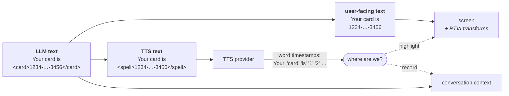
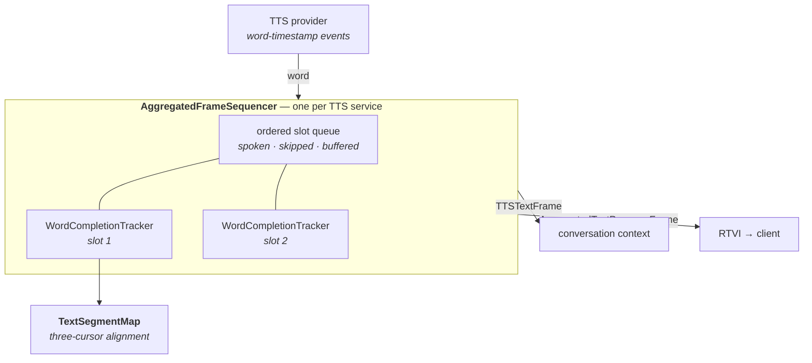

# TTS Word Tracking Architecture

How Pipecat keeps what the LLM wrote, what the user sees, and what the TTS speaks in
sync — word by word, while audio is playing.

| Document | Layer |
| --- | --- |
| [TextSegmentMap](./text-segment-map.md) | Aligns the three texts |
| [WordCompletionTracker](./word-completion-tracker.md) | Tracks one frame to completion |
| [AggregatedFrameSequencer](./aggregated-frame-sequencer.md) | Orders frames downstream |
| [RTVI integration](./rtvi-integration.md) | How the frames reach the client |

---

## 1. The end goal

One sentence from the LLM has to satisfy three consumers that want *different text*.

Take a bot that has been prompted to wrap credit cards in `<card>` tags and code in
`<code>` tags (this is the [`code-helper`](#5-the-code-helper-example) example):

**What the LLM produces:**

```
Your card is <card>1234-5678-9012-3456</card>. Run <code>npm install</code> to start.
```

From that single output, three things must happen:

| Consumer | Wants | Why |
| --- | --- | --- |
| **Conversation context** | `Your card is <card>1234-5678-9012-3456</card>. Run <code>npm install</code> to start.` | The LLM must see its own tags on the next turn, or it stops producing them |
| **The user's screen** | `Your card is XXXX-XXXX-XXXX-3456.` + a syntax-highlighted code block, with each word bolded as it is spoken | The UI renders and redacts; the raw tags are noise |
| **The TTS provider** | `Your card is <spell>1234-5678-9012-3456</spell>.` — and *nothing* for the code block | Digits must be spelled out; code must not be read aloud |

So there are three parallel texts for every sentence:



The provider streams back word-timestamp events containing only the words it actually
spoke. Those words are the *only* signal available, and they match none of the three
texts exactly. Everything in these documents exists to answer, for each incoming word:

1. **Where are we?** — which position in the user-facing text, so the UI can highlight it
2. **What do we record?** — which span of the *LLM* text, so the context keeps the tags
3. **When do we push it?** — in what order, relative to everything else in the turn

---

## 2. The problems this solves

### 2.1 The context drifted from what the LLM wrote

The text appended to the conversation context was the text that came *back from the TTS*,
not the text the LLM produced. Tags and formatting were stripped before synthesis, so
they never made it into the context.

The failure mode was subtle and slow: the LLM is asked to wrap credit cards in `<card>`
tags, does so on turn one, and then sees a context where its own tags are absent. After a
few turns it concludes the tags are not part of the conversation and **stops producing
them**. The feature quietly decays.

| | Before | Now |
| --- | --- | --- |
| Context receives | `Your card is 1234 5678 9012 3456` | `Your card is <card>1234-5678-9012-3456</card>` |
| Next turn | LLM sees no tags, stops emitting them | LLM sees its own convention, keeps it |

### 2.2 Skipped frames arrived out of order

A frame that is never sent to the TTS — a code block, with
`skip_aggregator_types=["code"]` — has no audio and no word events to wait for. It was
pushed the moment it appeared, so it landed *before* the sentence that precedes it:

```
LLM:      "Run this:"  →  <code>npm install</code>  →  "Then reload."

Context:  <code>npm install</code>      ← arrived first, nothing to wait for
          "Run this:"                   ← spoken later
          "Then reload."
```

The transcript reads out of order, and on interruption the mismatch is worse: text that
was never spoken could still be recorded as if it had been.

### 2.3 Highlighting spoken words was not possible

The UI receives sentence-level frames (`AggregationType.SENTENCE`) to render, and
word-level frames (`AggregationType.WORD`) as speech progresses. There was **no
correspondence between them** — a word frame carried no indication of which sentence
frame it belonged to, or where inside it. The client could not turn a stream of words
into a highlight moving through a rendered sentence.

### 2.4 RTVI `bot_output_transforms` were useless word-by-word

Client-side transforms — obfuscating a credit card before it reaches the screen — operate
on a segment. Receiving text word by word, with no segment identity and no notion of
"spoken so far" versus "remaining", left nothing coherent to transform. You could not
redact a credit card number that arrives as `1234`, `5678`, `9012`, `3456` across four
disconnected events.

### 2.5 Problems found along the way

| Problem | What happens |
| --- | --- |
| **Streamed tokens** | In `TOKEN` mode the service dispatches word-sized chunks, but tracking and progress need whole sentences — which are not known until a boundary is confirmed |
| **Concurrent contexts** | Two back-to-back `TTSSpeakFrame`s on a websocket service can be in flight at once; their word streams interleave and must not consume each other's slots |
| **Straddling tokens** | One provider token completes one frame and starts the next (`1111And`), so a single event must produce output for two slots, in the right order |
| **Dropped events** | The provider silently never reports a word it spoke, leaving a frame — and everything queued behind it — waiting forever |

### 2.6 And a feature: text transformations

Once the three texts are tracked independently, the TTS text can be rewritten freely for
better speech without the user or the context ever seeing the rewrite. These are the
built-in transforms (`src/pipecat/utils/text/transforms/`, bundled by `VoiceFormatter`):

| Transform | Input | Sent to TTS |
| --- | --- | --- |
| `expand_currency` | `It costs $42.50` | `It costs forty-two dollars and fifty cents` |
| `expand_percentages` | `Up 12.5%` | `Up twelve point five percent` |
| `expand_units` | `It is 5 km away` | `It is 5 kilometers away` |
| `normalize_dates` | `on 2024-01-15` | `on January 15th, two thousand and twenty-four` |
| `email_to_speech` | `a@b.com` | `a at b dot com` |
| `expand_phone_numbers` | `call 555-123-4567` | `call 5 5 5 1 2 3 4 5 6 7` |
| `expand_numbers` | `room 1994` | `room 1 9 9 4` |
| `normalize_acronyms` | `I work at IBM` | `I work at I B M` |
| `strip_markdown` | `**bold** text` | `bold text` |

Plus per-segment transformers registered on the service itself
(`tts.add_text_transformer(fn, "credit_card")`), which is how the `code-helper` example
wraps card numbers in Cartesia's `<spell>` tags and strips `https://` from links.

---

## 3. The three layers



Each layer owns one concern, and none of them knows about the layer above:

| Layer | Scope | Question it answers |
| --- | --- | --- |
| `TextSegmentMap` | One sentence | Where in the original text are we, given this spoken word? |
| `WordCompletionTracker` | One frame | Is this frame fully spoken, and what text does this word represent? |
| `AggregatedFrameSequencer` | The whole turn | In what order do frames leave the TTS service? |

**Why each one exists:**

- **`TextSegmentMap`** exists because the text sent to TTS is not the text the user sees
  or the LLM wrote, so something has to hold three cursors in alignment across transforms
  and markup while matching noisy, provider-specific word tokens.

- **`WordCompletionTracker`** exists because one aggregated frame needs a completion
  verdict and an attributed span per word even when the provider misbehaves — dropped
  events, straddling tokens — which is policy the pure alignment map deliberately does
  not own.

- **`AggregatedFrameSequencer`** exists because words arrive per-frame but the
  conversation context is global and ordered, so spoken, skipped, buffered, and
  concurrently-live-context frames must be serialized into one correct downstream
  timeline.

Mapped back to the problems:

| Problem | Solved by |
| --- | --- |
| 2.1 Context drift | `TextSegmentMap`'s `llm_pos` cursor + `WordCompletionTracker`'s span attribution |
| 2.2 Out-of-order skipped frames | `AggregatedFrameSequencer`'s slot queue |
| 2.3 Word ↔ sentence correspondence | `AggregatedTextProgressFrame`, built from the tracker's cursors |
| 2.4 Useless RTVI transforms | `segment_id` + `accumulated_text` / `remaining_text` on every progress frame |
| 2.5 Streaming / concurrency / provider quirks | Sequencer (streaming, contexts) + tracker (straddle, drops) |
| 2.6 Text transformations | `TextSegmentMap`'s transformed-segment handling |

---

## 4. Where they are wired up

All three are driven from `TTSService` (`src/pipecat/services/tts_service.py`). The
service owns one `AggregatedFrameSequencer`; the sequencer builds a
`WordCompletionTracker` per slot; each tracker builds one `TextSegmentMap`.

| `TTSService` | Sequencer method | When |
| --- | --- | --- |
| `_push_tts_frames` | `register_spoken` | A frame is dispatched to the TTS |
| `_push_tts_frames` | `register_skipped` | A frame bypasses TTS (e.g. a code block) |
| `_process_word_timestamps` | `process_word` | A word-timestamp event arrives |
| `_apply_force_complete` | `force_complete` | An audio context ends |
| end of text input | `finalize` | No more tokens for this context |
| interruption | `clear` | The turn is cancelled |

---

## 5. The code-helper example

`pipecat-examples/code-helper` exercises every part of this stack at once. Its bot
prompts the LLM to tag its output, then routes each tag type differently:

```python
# 1. Aggregate tagged segments separately
llm_text_aggregator.add_pattern(type="credit_card",
                                start_pattern="<card>", end_pattern="</card>",
                                action=MatchAction.AGGREGATE)

# 2. Never speak code blocks
tts = CartesiaTTSService(..., skip_aggregator_types=["code"])

# 3. Rewrite what the TTS receives, per segment type
tts.add_text_transformer(spell_out_text, "credit_card")   # wraps in <spell> tags
tts.add_text_transformer(strip_url_protocol, "link")      # drops "https://"

# 4. Redact what the client renders, per segment type
rtvi_observer_params=RTVIObserverParams(
    bot_output_transforms=[("credit_card", obfuscate_credit_card)]
)
```

Result, for one sentence:

| Channel | Text |
| --- | --- |
| LLM / context | `Your card is <card>1234-5678-9012-3456</card>` |
| TTS | `Your card is <spell>1234-5678-9012-3456</spell>` |
| Screen | `Your card is XXXX-XXXX-XXXX-3456`, bolded word by word as it is spoken |

The client is only ~10 lines of rendering logic, because the hard part is already done
server-side — see [RTVI integration](./rtvi-integration.md).

---

## 6. Tests

| File | Tests | Covers |
| --- | ---: | --- |
| `tests/test_text_segment_map.py` | 52 | Alignment, markup helpers, hop classification |
| `tests/test_word_completion_tracker.py` | 199 | Completion, attribution, provider quirks |
| `tests/test_aggregated_frame_sequencer.py` | 134 | Slot ordering, streaming, concurrent contexts |
| `tests/test_tts_frame_ordering.py` | 46 | End-to-end frame order through real services |
| `tests/test_cartesia_tts.py` | 13 | Cartesia word-timestamp shapes |
| `tests/test_soniox_tts.py` | 11 | Soniox word-timestamp shapes |

```bash
uv run pytest tests/test_text_segment_map.py tests/test_word_completion_tracker.py \
  tests/test_aggregated_frame_sequencer.py tests/test_tts_frame_ordering.py \
  tests/test_cartesia_tts.py tests/test_soniox_tts.py
```
