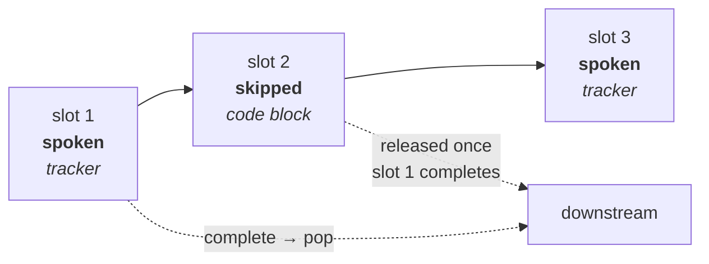
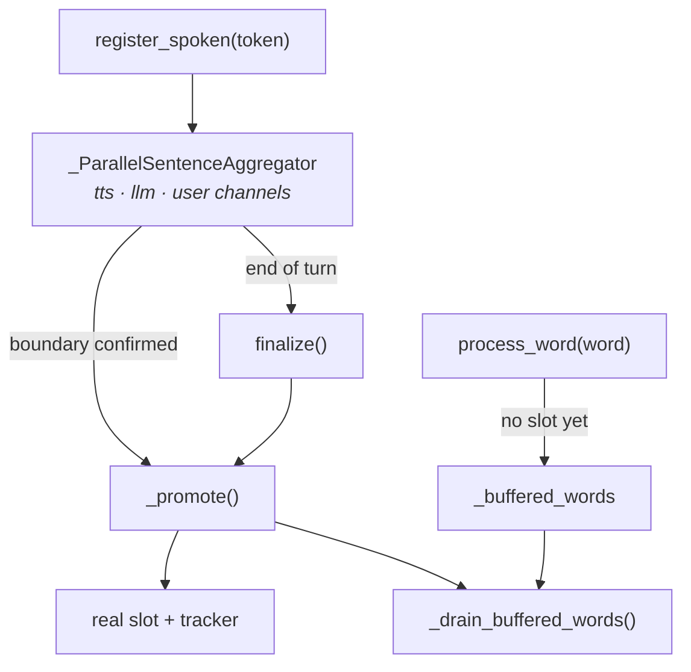

# AggregatedFrameSequencer

`src/pipecat/utils/context/aggregated_frame_sequencer.py`

## The problem

A [`WordCompletionTracker`](./word-completion-tracker.md) knows everything about *one*
frame and nothing about the turn it belongs to. But the conversation context is a single
ordered transcript, and several things conspire to scramble it:

- **Skipped frames.** A code block is never sent to TTS, so it has no words to wait for.
  Pushed the moment it appears, it lands *before* the sentence that precedes it.
- **Straddling tokens.** One token completes one frame and starts the next, so a single
  event has to produce output for two slots in the right order.
- **Streamed tokens.** In `TOKEN` mode the service dispatches word-sized chunks, but word
  tracking and RTVI progress need whole sentences — which are not known until a boundary
  is confirmed. Words can arrive before the sentence they belong to exists.
- **Concurrent contexts.** Two back-to-back `TTSSpeakFrame`s on a websocket service can
  be in flight at once. Their word streams interleave and must not consume each other's
  slots.
- **Silent providers.** A context can end with words still owed.

The sequencer is the single place all of that is serialized.

## The model: an ordered slot queue

Every frame passing through `_push_tts_frames` takes a slot, whether or not it is spoken:



`flush()` walks from the head: complete spoken slots are popped, skipped slots are
released, and the walk **stops at the first incomplete spoken slot**. That single rule is
what keeps a code block behind the sentence that precedes it.

### Worked example: a blocked code block

```python
seq = AggregatedFrameSequencer(name="demo")
await seq.register_spoken(spoken_frame, "ctx1", "Here is the code", append_to_context=True)
await seq.register_skipped(code_frame, "ctx1", None)   # -> [] — blocked
```

| call                     | frames returned                                          |
| ------------------------ | -------------------------------------------------------- |
| `register_skipped(code)` | *(nothing — held)*                                        |
| `process_word("Here")`   | `TTSTextFrame('Here')`, `Progress(acc='Here', rem=' is the code')` |
| `process_word("is")`     | `TTSTextFrame('is')`, `Progress(acc='Here is', rem=' the code')` |
| `process_word("the")`    | `TTSTextFrame('the')`, `Progress(acc='Here is the', rem=' code')` |
| `process_word("code")`   | `TTSTextFrame('code')`, `Progress(…, rem='')`, **`AggregatedTextFrame("print('hi')")`** |

The code block is released by the word that completes the sentence in front of it — in
the same call, in the correct position.

### Worked example: a straddling token

Two spoken frames registered back to back, then a token that spans both:

| call                       | frames returned                                        |
| -------------------------- | ------------------------------------------------------ |
| `process_word("is")`       | `TTSTextFrame('is')`, `Progress(acc='The code is', rem=' 1111')` |
| `process_word("1111And")`  | `TTSTextFrame('1111')`, `Progress(acc='The code is 1111', rem='')`, `TTSTextFrame('And')`, `Progress(acc='And', rem=' that is all')` |

The overflow half is re-entered through `process_word` against the next slot, so the
second frame gets its own correctly-attributed word frame and progress event.

## Three tiers of state

Concurrent contexts are the reason state is split rather than kept in one structure:

| Field                       | Scope       | Lifetime                                           |
| --------------------------- | ----------- | -------------------------------------------------- |
| `_slots`                    | Global      | The ordered timeline across all contexts — ordering is the point, so this stays one list |
| `_context_append_to_context` | Per context | Created at slot registration, removed by `force_complete`. Its *presence* marks the context live |
| `_streaming_contexts`       | Per context | Only while a sentence is accumulating from tokens; released by `finalize` |

The presence check is load-bearing: a word for a context with no entry is dropped as
stale. That is what stops word-timestamps a provider delivers seconds after an
interruption from being interleaved into the next turn.

```python
seq.process_word("Hello", pts=1000, context_id="ctx1")   # -> TTSTextFrame + Progress
seq.force_complete("ctx1", last_word_pts=2000)           # -> TTSTextFrame('there world')
seq.process_word("there", pts=3000, context_id="ctx1")   # -> [] — stale, dropped
```

`force_complete` is the safety net for silent providers: it emits the remaining unspoken
text of every incomplete slot for that context, flushes what that unblocks, and then
forgets the context.

Slots for *other* contexts are deliberately left alone, so their own words — or their own
`force_complete` — finish them.

### Concurrent contexts stay separate

```python
await seq.register_spoken(a, "ctxA", "alpha one", append_to_context=True)
await seq.register_spoken(b, "ctxB", "beta two", append_to_context=True)

seq.process_word("beta",  pts=1000, context_id="ctxB")   # -> TTSTextFrame('beta')
seq.process_word("alpha", pts=1000, context_id="ctxA")   # -> TTSTextFrame('alpha')
```

`ctxB`'s word is routed to `ctxB`'s slot even though `ctxA`'s slot is earlier in the
queue and still incomplete. A `None` context ID (legacy providers with no per-context
tagging, where concurrency cannot occur) matches any slot.

## Streaming mode

With `streaming=True` each `register_spoken` call is one *token*, not a complete unit.
Tokens are fed to a `_ParallelSentenceAggregator` and only become a real slot once a
sentence boundary is confirmed:



A boundary is only confirmed by *lookahead* — the first non-whitespace character of the
next sentence — so promotion always lags one token behind:

| call                       | frames returned                                  |
| -------------------------- | ------------------------------------------------ |
| `register_spoken("Hi")`    | *(nothing)*                                       |
| `register_spoken(" there!")` | *(nothing — boundary not yet confirmed)*        |
| `register_spoken(" Bye")`  | **`AggregatedTextFrame('Hi there!')`**            |
| `process_word("Hi")`       | `TTSTextFrame('Hi')`, `Progress(acc='Hi', rem=' there!')` |
| `finalize("ctx1")`         | **`AggregatedTextFrame(' Bye')`**                 |

`finalize` is what rescues a response ending without terminal punctuation.

### Buffered words

Because promotion lags, a word can arrive before its slot exists. It is parked, then
replayed on the next promotion:

| call                     | frames returned                                              |
| ------------------------ | ------------------------------------------------------------ |
| `register_spoken("Hello")` | *(nothing)*                                                 |
| `process_word("Hello")`  | *(nothing — buffered)*                                        |
| `finalize("ctx1")`       | `AggregatedTextFrame('Hello')`, `TTSTextFrame('Hello')`, `Progress(acc='Hello', rem='')` |

`_drain_buffered_words` snapshots and clears the buffer before replaying, so a word that
still matches nothing is re-buffered by `process_word` itself and waits for the next
promotion, instead of looping.

### Keeping three channels aligned

`_ParallelSentenceAggregator` accumulates all three texts in lockstep. A token stream is
not guaranteed to be one word per token — a coarse chunk can carry the tail of one
sentence and the head of the next — so the split point matters:

| Condition                                    | Cut                                          |
| -------------------------------------------- | -------------------------------------------- |
| All three channels identical (`_aligned`)    | *Inside* the token, at the confirmed offset  |
| A transform has diverged them                | At the token boundary                        |

Once a transform has made the channels differ in length there is no shared character
offset to cut at, so the whole triggering token starts the next sentence's buffer.

## Public surface

| Method                                | Async | Purpose                                            |
| ------------------------------------- | :---: | -------------------------------------------------- |
| `register_spoken(...)`                |   ✓   | A frame (or token) went to the TTS                 |
| `register_skipped(...)`               |   ✓   | A frame bypassed the TTS; finalizes any pending sentence first |
| `finalize(context_id)`                |   ✓   | End of text input — force-promote what is pending  |
| `process_word(word, pts, context_id)` |       | One word-timestamp event                            |
| `complete_spoken_slot()`              |       | Completion path for `push_text_frames=True` services |
| `flush(last_word_pts=None)`           |       | Release whatever is now unblocked                  |
| `force_complete(context_id, pts)`     |       | An audio context ended                              |
| `clear()`                             |       | Interruption — drop everything                      |

The three async methods are async only because they may drive the token aggregator;
everything else is synchronous and returns a list of frames for the caller to push, which
is what makes the sequencer straightforward to test.

## Tests

`tests/test_aggregated_frame_sequencer.py` — 134 tests.

| Group               | Classes                                                            |
| ------------------- | ------------------------------------------------------------------ |
| Slot mechanics      | `RegisterSkipped`, `CompleteSpokenSlot`, `Flush`, `ForceComplete`, `Clear` |
| Word routing        | `ProcessWordBasic`, `ProcessWordRawText`, `ProcessWordOverflow`, `ProcessWordForcesComplete`, `WordsAfterUnrepeatedPunctuation`, `TokenizationShapeResilience` |
| Streaming           | `RegisterSpokenStreaming`, `RegisterSpokenBufferedWords`, `RegisterSkippedForcesFinalize`, `FinalizeEndOfTurn`, `FinalizeRescuesMidSentencePrefix`, `ClearResetsStreamingState`, `ParallelSentenceAggregator` |
| Concurrency         | `ConcurrentContexts`                                                |
| Language / RTVI     | `CJKLanguages`, `CJKContextAssembly`, `CJKProcessWordFlagPropagation`, `AggregatedTextProgressFrame`, `VoiceFormattingTransforms` |

End-to-end coverage lives in `tests/test_tts_frame_ordering.py`, which drives all three
layers through mock HTTP, websocket, paused-websocket, and token-streaming services.
