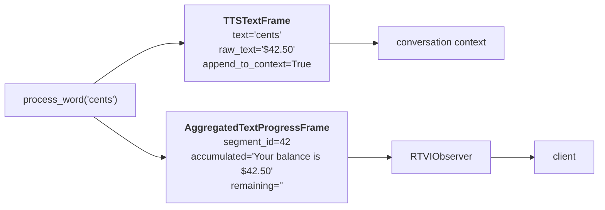

# RTVI Integration

> **Job:** turn tracked words into something a client can render and redact.

The three tracking layers exist to produce two frames per spoken word. This document
covers what those frames are, how they become RTVI messages, and how the
`pipecat-examples/code-helper` client uses them.

## 1. Two frames per word

Every call to `AggregatedFrameSequencer.process_word` builds up to two frames
(`_build_word_frame` and `_build_progress_frame`):

| Frame | Destination | Carries |
| --- | --- | --- |
| `TTSTextFrame` | The **conversation context** | The word, plus `raw_text` — the LLM span it represents |
| `AggregatedTextProgressFrame` | **RTVI → the client** | `segment_id` + `accumulated_text` / `remaining_text` |



### The context frame

`TTSTextFrame.raw_text` is the tracker's `get_llm_consumed()` — the LLM span attributed to
this word. That is what keeps `<card>…</card>` in the context instead of bare digits.

Two flags control whether a word is recorded at all:

| Flag | Set when | Effect |
| --- | --- | --- |
| `append_to_context` | Per context, at registration | Whole context excluded from the transcript |
| `suppress_in_context` | Tracker is mid-transformed-segment | This word excluded; only the completing word carries the original span |

That second one is why `forty`, `two`, `dollars` never reach the context — only `cents`
does, carrying `raw_text='$42.50'`.

### The progress frame

`AggregatedTextProgressFrame` is what made word highlighting possible. It solves the
correspondence problem directly: `segment_id` is the **id of the sentence
`AggregatedTextFrame`** the word belongs to, so a client can match a stream of words back
to the sentence it already rendered.

```python
AggregatedTextProgressFrame(
    segment_id=slot.frame.id,                              # ← the sentence's id
    context_id=slot.context_id,
    text=slot.frame.text,                                  # full sentence
    aggregated_by=slot.frame.aggregated_by,
    accumulated_text=tracker.get_accumulated_user_facing_text(),
    remaining_text=tracker.get_remaining_user_facing_text(strip=False),
)
```

`accumulated + remaining` reconstructs the sentence exactly (hence `strip=False`), so a
client can render the split without ever losing a character.

## 2. The segment lifecycle over RTVI

`RTVIObserver` turns those frames into `bot-output` messages with a three-state lifecycle
(protocol v2+):

```
   AggregatedTextFrame (sentence, will_be_spoken=True)
            │
            ▼
   spoken_status = "new"            accumulated=""              remaining=<full sentence>
            │                        ← client renders the sentence, stores segment_id
            │
   AggregatedTextProgressFrame (per word)
            │
            ▼
   spoken_status = "in-progress"    accumulated="Your balance"  remaining=" is $42.50"
   spoken_status = "in-progress"    accumulated="Your balance is" remaining=" $42.50"
            │                        ← client re-renders the bold/plain split
            ▼
   spoken_status = "completed"      accumulated=<full sentence> remaining=""
```

The status is derived, not tracked: the observer emits `"completed"` exactly when
`remaining == ""`.

Word- and token-level `bot-output` events are **suppressed** for v2 clients — progress is
covered entirely by `spoken_status` / `spoken_progress`, so the client sees one clean
stream of sentence-scoped updates rather than two overlapping ones.

## 3. Bot output transforms

`bot_output_transforms` let the application rewrite text before it reaches the client —
the credit-card redaction case. The progress-aware signature receives all three pieces:

```python
async def obfuscate_credit_card(
    text: str,
    agg_type: str,
    accumulated_text: str | None = None,
    remaining_text: str | None = None,
) -> BotOutputTransformResult:
    transformed = "XXXX-XXXX-XXXX-" + text[-4:]
    if accumulated_text is not None and remaining_text is not None:
        # Keep the highlight split proportional to the original
        ratio = len(accumulated_text) / max(len(text), 1)
        split = int(ratio * len(transformed))
        return BotOutputTransformResult(
            text=transformed,
            accumulated_text=transformed[:split],
            remaining_text=transformed[split:],
        )
    return BotOutputTransformResult(text=transformed)
```

This is the capability that was impossible before: the transform receives a **whole
segment** plus the current spoken split, so it can redact the full card number *and* keep
the highlight advancing over the redacted form. Given only disconnected word events
(`1234`, `5678`, `9012`, `3456`) there is nothing coherent to redact.

Transforms are registered per aggregation type, matching the types defined by the
`PatternPairAggregator`:

```python
rtvi_observer_params=RTVIObserverParams(
    bot_output_transforms=[("credit_card", obfuscate_credit_card)]
)
```

Use `"*"` to match every type.

## 4. The client side

With the server doing the work, `code-helper`'s client is almost trivial
(`client/src/app.js`):

```js
onBotOutput: (data) => {
  // A segment that is being spoken → update the highlight
  if (data.will_be_spoken && data.spoken_status !== 'new') {
    this.highlightSpokenText(data);
    return;
  }
  // Anything else (including spoken_status "new") → render a new bubble element
  this.addConversationMessage(
    data.text, 'bot', data.aggregated_by, data.segment_id,
  );
}

highlightSpokenText(data) {
  const curSpan = this.botSpans[data.segment_id];      // ← segment_id closes the loop
  if (!curSpan) return;
  const accumulatedText = data.spoken_progress.accumulated_text.replace(/\n/g, ' <br> ');
  const remainingText   = data.spoken_progress.remaining_text.replace(/\n/g, ' <br> ');
  curSpan.innerHTML = `<strong>${accumulatedText}</strong>${remainingText}`;
}
```

`data.aggregated_by` carries the segment type, so the client also renders a `code` segment
as a syntax-highlighted `<pre>` block and a `link` segment as an anchor — without parsing
any tags itself.

## 5. Everything together: code-helper

The bot (`pipecat-examples/code-helper/server/bot.py`) wires the whole stack in four
steps:

```python
# 1. Aggregate the LLM's tagged segments into typed units
llm_text_aggregator.add_pattern(type="credit_card",
                                start_pattern="<card>", end_pattern="</card>",
                                action=MatchAction.AGGREGATE)

# 2. Never send code blocks to the TTS  →  sequencer holds them in order
tts = CartesiaTTSService(..., skip_aggregator_types=["code"])

# 3. Rewrite what the TTS receives  →  TextSegmentMap tracks the divergence
tts.add_text_transformer(spell_out_text, "credit_card")   # wraps in <spell> tags
tts.add_text_transformer(strip_url_protocol, "link")      # drops "https://"

# 4. Redact what the client renders  →  progress frames make it possible
rtvi_observer_params=RTVIObserverParams(
    bot_output_transforms=[("credit_card", obfuscate_credit_card)]
)
```

For one sentence, all four channels stay correct and independent:

| Channel | Text |
| --- | --- |
| What the LLM produced | `Your card is <card>1234-5678-9012-3456</card>` |
| What the TTS received | `Your card is <spell>1234-5678-9012-3456</spell>` |
| What the context stored | `Your card is <card>1234-5678-9012-3456</card>` |
| What the user saw | `Your card is XXXX-XXXX-XXXX-3456`, bolded word by word |

And the code block, which is never spoken, still lands in the transcript **after** the
sentence that precedes it — because it waited its turn in the sequencer's slot queue.

## Related

- [Architecture overview](./README.md)
- [TextSegmentMap](./text-segment-map.md) — where the accumulated/remaining split comes from
- [AggregatedFrameSequencer](./aggregated-frame-sequencer.md) — where the frames are built
