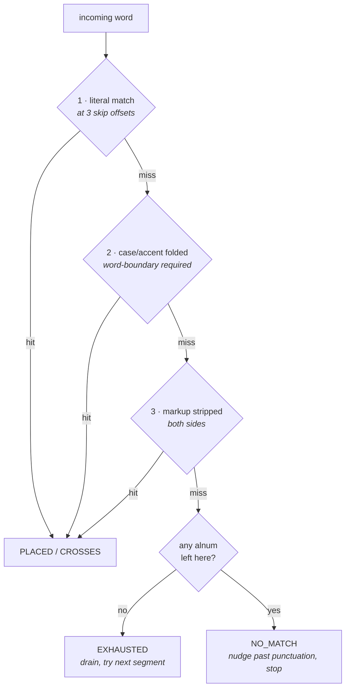

# TextSegmentMap

`src/pipecat/utils/context/text_segment_map.py`

## The problem

A TTS provider tells you it just spoke the word `dollars`. Nothing in that event says
which part of `Your balance is $42.50` you have reached — the word does not appear in
that text at all.

Every text transform creates the same gap:

| Transform          | Original            | Sent to TTS                          |
| ------------------ | ------------------- | ------------------------------------ |
| Currency expansion | `$42.50`            | `forty two dollars and fifty cents`  |
| Number expansion   | `1994`              | `nineteen ninety four`               |
| SSML markup        | `Siobhan`           | `<phoneme alphabet="ipa">…</phoneme>` |
| Pattern delimiters | `<card>4111</card>` | `4111`                               |

Something has to translate a position in the spoken stream back into a position in the
original text. That is the whole job of `TextSegmentMap`.

## The solution: diff into segments, then walk

At construction the map diffs the TTS text against the original text at word level
(`difflib.SequenceMatcher`) and turns each opcode into a `TextSegment`:

```python
TextSegmentMap(
    "Your balance is forty two dollars and fifty cents",  # tts_text
    "Your balance is $42.50",                             # original_text
)
```

produces:

```
original='Your balance is '  tts='Your balance is '                    span=(0,16)  transformed=False
original='$42.50'            tts='forty two dollars and fifty cents'   span=(16,22) transformed=True
```

A segment is **transformed** (`TextSegment.is_transformed`) when its two sides cannot be
walked character for character — the alphanumeric content differs, the word count
differs, or the TTS side carries markup.

That distinction drives everything. One cursor, `raw_pos`, moves through the TTS text as
words arrive. The `user_facing_pos` and `llm_pos` cursors are derived from it:

- **Unchanged segment** — they advance proportionally, word by word.
- **Transformed segment** — they are *held* until the segment's entire TTS text is
  consumed, then jump to the end of the original span in one step. There is no meaningful
  mid-`$42.50` position, so the map refuses to invent one.

### Worked example

Feeding the nine spoken words in one at a time:

| word      | `raw_pos` | `user_facing_pos` | `in_transformed_segment` | accumulated user-facing text |
| --------- | --------: | ----------------: | ------------------------ | ---------------------------- |
| `Your`    |         4 |                 4 | False                    | `Your`                       |
| `balance` |        12 |                12 | False                    | `Your balance`               |
| `is`      |        15 |                15 | False                    | `Your balance is`            |
| `forty`   |        21 |                15 | **True**                 | `Your balance is`            |
| `two`     |        25 |                15 | **True**                 | `Your balance is`            |
| `dollars` |        33 |                15 | **True**                 | `Your balance is`            |
| `and`     |        37 |                15 | **True**                 | `Your balance is`            |
| `fifty`   |        43 |                15 | **True**                 | `Your balance is`            |
| `cents`   |        49 |            **22** | False                    | `Your balance is $42.50`     |

The raw cursor climbs steadily; the user-facing cursor freezes at 15 for five words and
then jumps straight to 22. `last_completed_segment` now reports the `$42.50` segment —
that is the signal callers use to attribute the whole original span to the word that
completed it.

## Matching real provider tokens

The other half of the job is that word-timestamp tokens are *messy*. The same underlying
word arrives differently depending on the provider, and none of them match the source
text exactly:

| Provider behaviour              | Source text        | Token that arrives |
| ------------------------------- | ------------------ | ------------------ |
| Adds terminal punctuation       | `my account`       | `account.`         |
| Lowercases                      | `SQL`              | `sql`              |
| Strips diacritics               | `café`             | `cafe`             |
| Carries its own leading space   | `world`            | `" world"`         |
| Omits punctuation it skipped    | `Yeah, I can`      | `I`                |
| Splits a tag across events      | `<phoneme a="b">`  | `alphabet="ipa"`   |
| Substitutes a symbol            | `→`                | `-`                |
| Straddles a frame boundary      | `1111` + `And`     | `1111And`          |

Rather than special-casing each provider, `_classify_hop` matches the token against the
segment's remaining raw text with three strategies, in order:



Every strategy also retries with the word's own trailing punctuation removed. The whole
thing is stateless — recomputed fresh on every call, with no tag parsing and no
cross-call bookkeeping — which is what keeps the matching predictable.

The four outcomes:

| Outcome     | Meaning                                                | Effect                                    |
| ----------- | ------------------------------------------------------ | ----------------------------------------- |
| `PLACED`    | Word fits inside this segment                          | Advance to the matched end, stop          |
| `CROSSES`   | Segment's remainder is only a prefix of the word       | Drain segment, carry remainder onward     |
| `EXHAUSTED` | No spoken content left here (`<break/>`, whitespace)   | Drain segment, retry the whole word       |
| `NO_MATCH`  | Word does not belong here                              | Nudge past leading punctuation, stop      |

### Why case-folding needs a word boundary

Folding erases case, which can manufacture a false match: folded `account` is a prefix of
folded `Accountant`. Strategy 2 therefore only accepts a `PLACED` match that lands on a
word boundary. Strategy 1 does not need the guard — it is case-sensitive already.

## Splitting markup out of a segment

A segment holding any markup is atomic, so a tag sitting in the middle of otherwise
identical text would freeze the cursors across the whole sentence. `_split_markup_runs`
prevents that by giving the tag its own segment:

```python
_split_markup_runs("I love to count <spell>1234</spell>.")
# -> ["I love to count ", "<spell>1234</spell>."]
```

```
"I love to count "       plain   — cursors advance word by word
"<spell>1234</spell>."   atomic  — commits when its last word lands
```

Only `equal` opcodes can be split this way: both sides hold the same text, so a single
offset cuts both.

## Two definitions of "markup"

The file deliberately carries two strippers, because a streamed fragment and a complete
text need opposite treatment of a lone `<`:

| Function                 | Input                  | `5 < 10` becomes | Used for                                  |
| ------------------------ | ---------------------- | ---------------- | ----------------------------------------- |
| `strip_markup`           | A possibly-cut token   | `5 `             | Matching a token that may be mid-tag      |
| `strip_complete_markup`  | A whole, static text   | `5 < 10`         | `is_transformed`, default user-facing text |

In a truncated fragment an unclosed `<` really is the start of a tag, so swallowing the
rest is correct. In a complete text it is real content.

## Public surface

| Member                        | Purpose                                                      |
| ----------------------------- | ------------------------------------------------------------ |
| `advance_word(word)`          | Consume one token, moving all cursors                        |
| `word_belongs_current_segment(word)` | Non-mutating dry run of the same matching             |
| `user_facing_pos` / `llm_pos` / `raw_pos` | The three cursors                          |
| `is_complete`                 | All alphanumeric content accounted for                       |
| `in_transformed_segment`      | Cursor sits mid-transform (callers suppress context writes)  |
| `last_completed_segment`      | Segment finished by the last `advance_word`                  |
| `last_overflow`               | Raw suffix that ran past the end of the TTS text             |

Two details in `is_complete` are worth knowing. A frame whose remainder is pure
punctuation or markup is already complete — a closing tag never arrives as its own token.
The exception is punctuation set off by a space (French `Comment ça va ?`), which *is*
emitted as its own token, so `_pending_separated_punctuation` holds completion open for
it.

## Tests

`tests/test_text_segment_map.py` — 52 tests.

| Class                                        | Covers                                        |
| -------------------------------------------- | --------------------------------------------- |
| `TestStripMarkupHelpers`                     | `strip_markup`, `_raw_len_for_clean_chars` round-trip |
| `TestStripCompleteMarkupHelper`              | Lone `<` kept as content                      |
| `TestTextSegmentMapBuild`                    | Segment construction and spans                |
| `TestTextSegmentMapAdvance`                  | Cursor hold/jump behaviour                    |
| `TestTextSegmentMapWithLlmText`              | The third cursor                              |
| `TestTextSegmentMapTokenChangingReplacements` | Replacements that change word count          |
| `TestTextSegmentMapSsmlPhonemeTag`           | Markup segments                               |
| `TestClassifyHopSkipsLeadingPunctuation`     | Strategy 1's skip offsets                     |
| `TestClassifyHopCaseFoldRequiresWordBoundary` | The `account` / `Accountant` guard           |
| `TestProviderTokenShapes`                    | Leading-space tokens                          |
| `TestWordCarriesItsOwnPunctuation`           | Provider-added terminal punctuation           |
