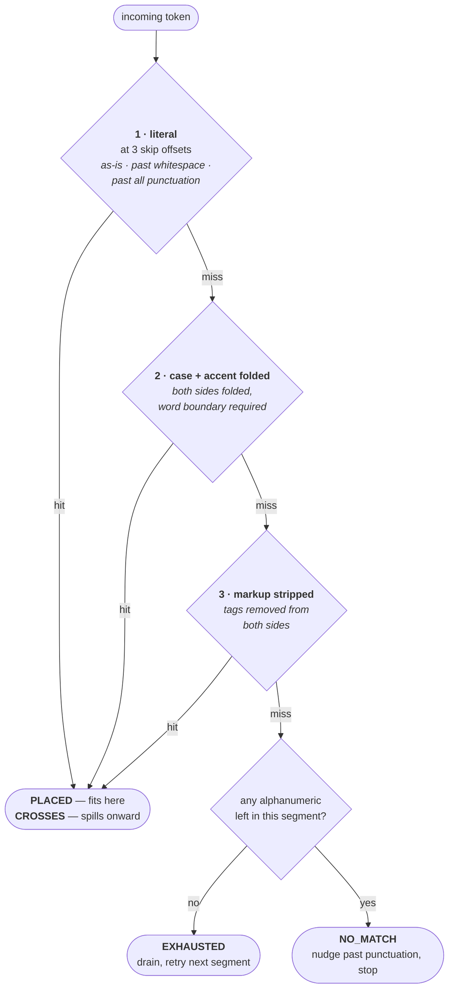

# TextSegmentMap

`src/pipecat/utils/context/text_segment_map.py`

> **Job:** given a word the TTS just spoke, say where we are in *all three* texts.

## 1. The problems

### 1.1 The spoken word does not appear in the original text

A provider tells you it just spoke `dollars`. Nothing in that event says which part of
`Your balance is $42.50` you have reached — the word does not appear in that text at all.

Every transform opens the same gap:

| Transform | Original | Sent to TTS |
| --- | --- | --- |
| Currency expansion | `$42.50` | `forty-two dollars and fifty cents` |
| Number expansion | `room 1994` | `room 1 9 9 4` |
| SSML markup | `1234-5678` | `<spell>1234-5678</spell>` |
| URL cleanup | `https://pipecat.ai` | `pipecat.ai` |
| Pattern delimiters | `<card>4111</card>` | `4111` |

Without a mapping, the UI cannot highlight what is being said, because it has no idea
where in the rendered sentence the audio has reached.

### 1.2 The context drifted from what the LLM wrote

The second problem is the one that silently degrades a bot over time. Delimiters the LLM
was asked to produce are stripped before synthesis, so if the context is rebuilt from what
the TTS spoke, **the tags vanish from the conversation history**. The LLM then sees a
transcript where its own convention is absent and stops producing it.

That is why the map tracks a *third* text. The two it diffs are `tts_text` and
`original_text` (user-facing); `llm_text` rides along on its own cursor:

| Cursor | Text | Consumer |
| --- | --- | --- |
| `raw_pos` | `Your card is 4111` | The TTS stream — the only cursor that really moves |
| `user_facing_pos` | `Your card is 4111` | The screen |
| `llm_pos` | `Your card is <card>4111</card>` | The conversation context |

Walking that example one word at a time, the two derived cursors stay together until the
tag appears, then diverge:

| word | `raw_pos` | `user_facing_pos` | `llm_pos` | LLM text consumed |
| --- | ---: | ---: | ---: | --- |
| `Your` | 4 | 4 | 4 | `Your` |
| `card` | 9 | 9 | 9 | `Your card` |
| `is` | 12 | 12 | 12 | `Your card is` |
| `4111` | 17 | 17 | **23** | `Your card is <card>4111` |

`llm_pos` jumps to 23 rather than 17 because it stepped over `<card>` on the way to the
digits. The opening tag is therefore attributed to the word `4111` and reaches the context
with it. (The closing tag is swept up by
[`WordCompletionTracker`](./word-completion-tracker.md) when the frame completes.)

Something has to translate a position in the spoken stream into a position in *both* other
texts. That is the entire job of `TextSegmentMap`.

## 2. Building the map: opcodes

At construction the map compares the TTS text against the original text using
`difflib.SequenceMatcher`, **at word level** (the text is tokenized on whitespace, keeping
the whitespace as tokens so offsets stay exact).

### What an opcode is

`SequenceMatcher` does not just say "these differ" — it returns a list of **opcodes**,
each one an instruction describing how a run of the original maps onto a run of the TTS
text. There are four kinds:

| Opcode | Meaning | Produced by |
| --- | --- | --- |
| `equal` | This run is identical on both sides | Any untouched text — the common case |
| `replace` | This run of the original was rewritten into that run of the TTS text | Every value transform and every added tag |
| `delete` | This run exists in the original but not in the TTS text | A filter that removes a whole word |
| `insert` | This run exists in the TTS text but not in the original | A transform that adds a whole word |

**All four occur** — the map handles them uniformly, so none is a special case in the
code. `equal` and `replace` dominate, because most transforms rewrite a token in place
rather than adding or removing one; `delete` and `insert` only appear when a whole
whitespace-delimited token disappears or appears.

Real output for two `replace` examples:

```
original = 'Your balance is $42.50'
tts      = 'Your balance is forty-two dollars and fifty cents'

   equal    original='Your balance is '   tts='Your balance is '
   replace  original='$42.50'             tts='forty-two dollars and fifty cents'
```

```
original = 'Visit https://pipecat.ai now'
tts      = 'Visit pipecat.ai now'

   equal    original='Visit '             tts='Visit '
   replace  original='https://pipecat.ai' tts='pipecat.ai'
   equal    original=' now'               tts=' now'
```

And for `delete` and `insert`, which produce a segment with one empty side:

```
original = 'Hello there world'          original = 'Hello world'
tts      = 'Hello world'                tts      = 'Hello there world'

   equal    original='Hello '              equal    original='Hello '
   delete   original='there '  tts=''      insert   original=''       tts='there '
   equal    original='world'               equal    original='world'
```

Each opcode becomes one `TextSegment`, carrying both sides plus the span it occupies in
the original text:

```python
TextSegment(original='$42.50',
            tts='forty-two dollars and fifty cents',
            original_start=16, original_end=22)
```

### Transformed vs unchanged segments

A segment is **transformed** (`TextSegment.is_transformed`) when its two sides cannot be
walked character for character. Three things trigger it:

1. The alphanumeric content differs (`$42.50` vs `forty-two dollars…`)
2. The word count differs (a replacement changed tokenization)
3. The TTS side contains markup — even if the spoken content is identical

That third rule is why `<phoneme alphabet="ipa">Siobhan</phoneme>` counts as transformed:
the raw cursor must move through the tag characters while the original cursor stays put.

### Splitting markup into its own segment

Rule 3 has a cost. A segment holding *any* markup is atomic, so one tag in the middle of
otherwise identical text would freeze the cursors across the whole sentence. To contain
that, `_build` splits an `equal` opcode around the markup it carries:

```python
_split_markup_runs("I love to count <spell>1234</spell>.")
# -> ["I love to count ", "<spell>1234</spell>."]
```

```
"I love to count "       plain   — cursors advance word by word
"<spell>1234</spell>."   atomic  — commits when its last word lands
```

Only `equal` opcodes can be split this way: both sides hold the same text, so a single
offset cuts both. The other kinds differ side to side, leaving no shared offset to cut at.

## 3. Walking the map: one cursor drives three

There is exactly one real cursor — `raw_pos`, the position reached in the TTS text.
`user_facing_pos` and `llm_pos` are derived from it:

- **Unchanged segment** — they advance proportionally, word for word.
- **Transformed segment** — they are *held* until the segment's entire TTS text is
  consumed, then jump to the end of its original span in one step. There is no meaningful
  position halfway through `$42.50`, so the map refuses to invent one.

### Worked example

```python
TextSegmentMap(
    tts_text      = "Your balance is forty-two dollars and fifty cents",
    original_text = "Your balance is $42.50",     # user-facing
    llm_text      = "Your balance is $42.50",     # what the LLM wrote
)
```

Feeding the eight spoken words in one at a time:

| word | `raw_pos` | `user_facing_pos` | `llm_pos` | `in_transformed_segment` | accumulated user-facing |
| --- | ---: | ---: | ---: | --- | --- |
| `Your` | 4 | 4 | 4 | False | `Your` |
| `balance` | 12 | 12 | 12 | False | `Your balance` |
| `is` | 15 | 15 | 15 | False | `Your balance is` |
| `forty-two` | 25 | 15 | 15 | **True** | `Your balance is` |
| `dollars` | 33 | 15 | 15 | **True** | `Your balance is` |
| `and` | 37 | 15 | 15 | **True** | `Your balance is` |
| `fifty` | 43 | 15 | 15 | **True** | `Your balance is` |
| `cents` | 49 | **22** | **22** | False | `Your balance is $42.50` |

The raw cursor climbs steadily. The other two freeze at 15 for four words, then jump
straight to 22 when the segment completes. `last_completed_segment` then reports the
`$42.50` segment — the signal callers use to attribute the whole original span to the word
that finished it.

When the LLM text has extra delimiters the third cursor diverges from the second:
`llm_text="Your balance is <price>$42.50</price>"` moves `llm_pos` past the tags while
`user_facing_pos` never sees them.

### Empty-sided segments

A `delete` or `insert` opcode produces a segment with nothing on one side. Both are
transformed (their two sides differ), and both resolve without any special handling:

**`delete` — text that exists only in the original.** The segment's TTS side is empty, so
no word will ever arrive for it. It is drained as soon as the next word shows up, and its
original text is credited to that word:

```
tts='Hello world'   original='Hello there world'

  word='Hello'   user_facing_pos=5    'Hello'
  word='world'   user_facing_pos=17   'Hello there world'   ← 'there ' folded in here
```

The deleted word is never lost from the user-facing text or the context; it is simply
never spoken.

**`insert` — text that exists only in the TTS side.** The segment's original span is
empty (`original_start == original_end`), so the inserted word consumes raw text but
advances the other two cursors by nothing:

```
tts='Hello there world'   original='Hello world'

  word='Hello'   raw_pos=5    user_facing_pos=5
  word='there'   raw_pos=12   user_facing_pos=6    ← raw moves, original does not
  word='world'   raw_pos=17   user_facing_pos=11
```


## 4. Matching real provider tokens

The other half of the job: word-timestamp tokens are *messy*, and no two providers agree.
Rather than special-casing each one, `_classify_hop` matches the token against the
segment's remaining raw text using three strategies, in order, stopping at the first hit.



Every strategy also retries with the token's own trailing punctuation removed. The whole
thing is stateless — recomputed fresh each call, no tag parsing, no cross-call
bookkeeping.

### Which strategy fires, for real token shapes

| Provider behaviour | Segment remaining | Token | Strategy | Result |
| --- | --- | --- | --- | --- |
| Plain word | `hello world` | `hello` | 1 literal | `PLACED` (5 chars) |
| Token carries its own leading space (Inworld) | `" world"` | `" world"` | 1 literal | `PLACED` (6 chars) |
| Provider skipped punctuation it did not speak | `", I can help"` | `I` | 1 literal *(skip offset)* | `PLACED` (3 chars) |
| Provider added a terminal period | `account and more` | `account.` | 1 literal *(trailing trim)* | `PLACED` (7 chars) |
| Provider lowercased the word | `SQL is great` | `sql` | 2 folded | `PLACED` (3 chars) |
| Provider stripped a diacritic | `café open` | `cafe` | 2 folded | `PLACED` (4 chars) |
| Token reported without its tags | `<spell>1234</spell> ok` | `1234` | 3 markup | `PLACED` (11 chars) |
| Token straddles the frame boundary | `1111` | `1111And` | 1 literal | `CROSSES` (4 chars used) |
| Foreign token (dropped event upstream) | `hello world` | `goodbye` | none | `NO_MATCH` |
| Nothing spoken left here | `<break/>` | `hello` | none | `EXHAUSTED` |

Note how strategy 1 alone covers four different TTS provider quirks, because it tries three
skip offsets *and* a trailing-punctuation-trimmed variant of the token.

### The four outcomes

| Outcome | Meaning | Effect |
| --- | --- | --- |
| `PLACED` | Token fits inside this segment | Advance to the matched end, stop |
| `CROSSES` | Segment's remainder is only a prefix of the token | Drain segment, carry the **remainder** onward |
| `EXHAUSTED` | No spoken content left here | Drain segment, carry the **whole token** onward |
| `NO_MATCH` | Token does not belong here | Nudge past leading punctuation, stop |

`PLACED` and `NO_MATCH` end the walk. `CROSSES` and `EXHAUSTED` do not — they complete the
current segment and loop to the next one, where the token is classified again from
scratch. The difference is only how much of the token survives the hop.

**`CROSSES` — the token outlives the segment.** A provider that merges two words into one
token produces this. The segment's remaining text is consumed as a prefix of the token,
the segment completes (jumping the cursors, since it is now finished), and the unmatched
tail is re-classified against the next segment:

```
tts='Hello five'   original='Hello 5'
  seg0: 'Hello '  (unchanged)
  seg1: '5' → 'five'  (transformed)

  token 'Hello five'
    ├─ seg0: CROSSES, 6 chars consumed → seg0 completes, remainder 'five'
    └─ seg1: PLACED  → seg1 completes, user_facing_pos jumps to 7 ('Hello 5')
```

One incoming token therefore completed two segments and moved the user-facing cursor
across a transform, in a single `advance_word` call.

**`EXHAUSTED` — the segment outlives nothing.** The segment has no alphanumeric content
left to speak (a `delete` opcode's empty side, a self-closing `<break/>`, or only trailing
whitespace), so no word will ever match it. It is drained and the *entire* token — nothing
was consumed — moves to the next segment:

```
tts='Hello world'   original='Hello there world'
  seg1: 'there ' → ''   (delete opcode, nothing to speak)

  token 'world'
    ├─ seg1: EXHAUSTED, 0 chars consumed → seg1 completes, token unchanged
    └─ seg2: PLACED  → 'world' lands, user_facing_pos jumps past 'there ' too
```

If a `CROSSES` remainder runs out of segments entirely, the leftover is exposed as
`last_overflow` — that is the straddling-token case the frame above handles.

### Why folding needs a word boundary

Folding erases case, which can manufacture a false match: folded `account` is a prefix of
folded `Accountant`. Strategy 2 therefore only accepts a `PLACED` match that lands on a
word boundary. Strategy 1 does not need the guard — it is case-sensitive already.

## 5. Two definitions of "markup"

The file deliberately carries two strippers, because a streamed fragment and a complete
text need opposite treatment of a lone `<`:

| Function | Input | `5 < 10` becomes | Used for |
| --- | --- | --- | --- |
| `strip_markup` | A possibly-truncated token | `5 ` | Matching a token that may be mid-tag |
| `strip_complete_markup` | A whole, static text | `5 < 10` | `is_transformed`, default user-facing text |

The two agree on everything except an unmatched `<`:

| Input | `strip_markup` | `strip_complete_markup` | |
| --- | --- | --- | --- |
| `<b>hi</b> there` | `hi there` | `hi there` | agree |
| `a<break/>b` | `ab` | `ab` | agree |
| `x < y > z` | `x  z` | `x  z` | agree |
| `keep <phoneme attr` | `keep ` | `keep <phoneme attr` | **differ** |
| `5 < 10` | `5 ` | `5 < 10` | **differ** |
| `I <3 this` | `I ` | `I <3 this` | **differ** |

### Why having two is safe

Each is applied only where its assumption actually holds, so the disagreement never
matters:

- **`strip_markup` runs on provider tokens.** These are *fragments* — some providers split
  a multi-attribute tag across several word-timestamp events, so a token really can end
  mid-tag (`<phoneme alphabet="ipa"` with the `>` in the next event). Treating a trailing
  `<` as an unfinished tag is the correct reading, and it is only ever used to *compare*
  against the source text — a wrong guess causes a failed match, which falls through to
  `NO_MATCH`, not a corrupted cursor.

- **`strip_complete_markup` runs on whole texts we assembled ourselves.** Nothing here is
  truncated, so a lone `<` is content the LLM genuinely wrote — `5 < 10`, `I <3 this`, a
  generic type like `List<int>`. Swallowing the rest of the sentence would silently drop
  real text from the user-facing view and from `is_transformed`'s judgement.

Applying either function to the other's input is what would be unsafe; keeping them
separate is what makes each one correct in its own place.

## 6. Public surface

| Member | Purpose |
| --- | --- |
| `advance_word(word)` | Consume one token, moving all cursors |
| `word_belongs_current_segment(word)` | Non-mutating dry run of the same matching |
| `user_facing_pos` / `llm_pos` / `raw_pos` | The three cursors |
| `is_complete` | All alphanumeric content accounted for |
| `in_transformed_segment` | Cursor sits mid-transform (callers suppress context writes) |
| `last_completed_segment` | Segment finished by the last `advance_word` |
| `last_overflow` | Raw suffix that ran past the end of the TTS text |

Two details in `is_complete` are worth knowing. A frame whose remainder is pure
punctuation or markup is already complete — a closing tag never arrives as its own token.
The exception is punctuation set off by a space (French `Comment ça va ?`), which *is*
emitted as its own token, so `_pending_separated_punctuation` holds completion open for it.

## 7. Tests

`tests/test_text_segment_map.py` — 52 tests.

| Class | Covers |
| --- | --- |
| `TestStripMarkupHelpers` | `strip_markup`, `_raw_len_for_clean_chars` round-trip |
| `TestStripCompleteMarkupHelper` | Lone `<` kept as content |
| `TestTextSegmentMapBuild` | Segment construction and spans |
| `TestTextSegmentMapAdvance` | Cursor hold/jump behaviour |
| `TestTextSegmentMapWithLlmText` | The third cursor |
| `TestTextSegmentMapTokenChangingReplacements` | Replacements that change word count |
| `TestTextSegmentMapSsmlPhonemeTag` | Markup segments |
| `TestClassifyHopSkipsLeadingPunctuation` | Strategy 1's skip offsets |
| `TestClassifyHopCaseFoldRequiresWordBoundary` | The `account` / `Accountant` guard |
| `TestProviderTokenShapes` | Leading-space tokens |
| `TestWordCarriesItsOwnPunctuation` | Provider-added terminal punctuation |
