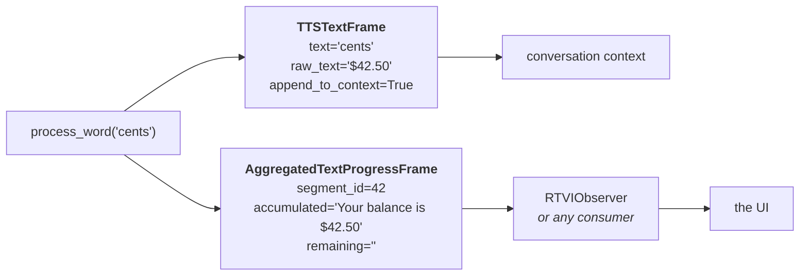
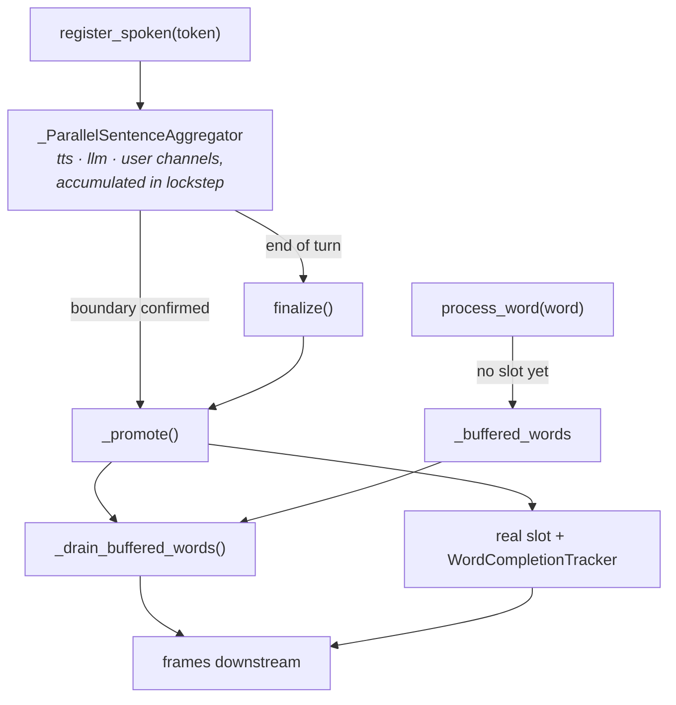

# AggregatedFrameSequencer

`src/pipecat/utils/context/aggregated_frame_sequencer.py`

> **Job:** decide the order in which frames leave the TTS service.

A [`WordCompletionTracker`](./word-completion-tracker.md) knows everything about *one*
frame and nothing about the turn it belongs to. But the conversation context is a single
ordered transcript. The sequencer is where that ordering is enforced.

Section 1 covers **what** it emits. The rest cover the three distinct ordering concerns it
exists to solve:

| # | Concern | Core mechanism |
| --- | --- | --- |
| **2** | [Frame ordering](#2-frame-ordering) — including frames that are never spoken | The ordered slot queue |
| **3** | [Concurrent contexts](#3-concurrent-contexts) — two utterances in flight at once | Per-context routing and liveness |
| **4** | [Token mode](#4-token-mode-streaming) — word-sized chunks that must become sentences | Pending-sentence promotion + word buffering |

---

## 1. The output: two frames per word

Before the ordering rules, it helps to know what the sequencer actually emits. Every call
to `process_word` builds up to two frames — `_build_word_frame` and
`_build_progress_frame` — each aimed at a different consumer:

| Frame | Destination | Carries |
| --- | --- | --- |
| `TTSTextFrame` | The **conversation context** | The word, plus `raw_text` — the LLM span it represents |
| `AggregatedTextProgressFrame` | **Any downstream consumer** — a UI via RTVI is the usual one | `segment_id` + `accumulated_text` / `remaining_text` |



### The context frame

`TTSTextFrame.raw_text` is the tracker's `get_llm_consumed()` — the LLM span attributed to
this word. That is what keeps `<card>…</card>` in the context instead of bare digits.

Two flags control whether a word is recorded at all:

| Flag | Set when | Effect |
| --- | --- | --- |
| `append_to_context` | Per context, at registration | Whole context excluded from the transcript |
| `suppress_in_context` | Tracker is mid-transformed-segment | This word excluded; only the completing word carries the original span |

That second one is why `forty-two`, `dollars`, `and` and `fifty` never reach the context —
only `cents` does, carrying `raw_text='$42.50'`.

### The progress frame

`AggregatedTextProgressFrame` is what made word highlighting possible. It solves the
correspondence problem directly: `segment_id` is the **id of the sentence
`AggregatedTextFrame`** the word belongs to, so a client can match a stream of words back
to the sentence it already rendered.

```python
AggregatedTextProgressFrame(
    segment_id=slot.frame.id,  # ← the sentence's id
    context_id=slot.context_id,
    text=slot.frame.text,  # full sentence
    aggregated_by=slot.frame.aggregated_by,
    accumulated_text=tracker.get_accumulated_user_facing_text(),
    remaining_text=tracker.get_remaining_user_facing_text(strip=False),
)
```

`accumulated_text + remaining_text` reconstructs `AggregatedTextFrame.text` exactly (hence
`strip=False`), so any consumer holding the segment frame can position into the string it
already has without ever losing a character. Highlighting text in a UI is the usual case
and the example used throughout, but nothing here is UI- or RTVI-specific; see
[the guarantee](./README.md#33-the-guarantee-that-makes-it-useful). What the client does with it
is covered in [RTVI integration](./rtvi-integration.md).

A progress frame accompanies a word frame whenever the word was matched to a real slot and
`suppress_in_context()` is False. Two cases produce a word frame alone: a word held
mid-transform (no meaningful position to report yet), and a word emitted beside the queue
because no slot is active at all (no segment to report progress against).

---

## 2. Frame ordering

### The problem

Not every frame reaches the TTS. A code block configured with
`skip_aggregator_types=["code"]` is never synthesized, so it has no audio and no word
events to wait for. Pushed the moment it appears, it lands *before* the sentence that
precedes it — because that sentence is still being spoken.

```
LLM emits:   "Run this:"      <code>npm install</code>      "Then reload."
                  │                      │                        │
                  │ sent to TTS          │ skipped                │ sent to TTS
                  ▼                      ▼                        ▼
             (speaking…)            pushed instantly         (speaking…)

Context:     <code>npm install</code>   ← WRONG: arrived first
             "Run this:"
             "Then reload."
```

### The model: an ordered slot queue

**Every** frame passing through `_push_tts_frames` takes a slot, whether or not it is
spoken. **A skipped frame waits in the queue at its correct position.**

```
        head                                                   tail
         │                                                       │
         ▼                                                       ▼
    ┌──────────────┐   ┌──────────────┐   ┌──────────────┐
    │  slot 1      │   │  slot 2      │   │  slot 3      │
    │  SPOKEN      │──▶│  SKIPPED     │──▶│  SPOKEN      │
    │ "Run this:"  │   │ npm install  │   │"Then reload."│
    │ tracker ●    │   │ no tracker   │   │ tracker ●    │
    │ complete: ✗  │   │              │   │ complete: ✗  │
    └──────────────┘   └──────────────┘   └──────────────┘
         ▲
         └── flush() stops here: spoken, not complete
```

`flush()` walks from the head and applies one rule:

| Slot at head | Action |
| --- | --- |
| Spoken **and** complete | Pop it, keep walking |
| Skipped | Emit it, pop it, keep walking |
| Spoken **and not** complete | **Stop** |

**That single rule is the whole ordering guarantee.** As words arrive and slot 1 completes,
the queue drains and slot 2 is released — in the right position, at the right time:

```
after "Run"      ┌─ SPOKEN ✗ ─┐  ┌─ SKIPPED ─┐  ┌─ SPOKEN ✗ ─┐   flush → nothing
after "this:"    ┌─ SPOKEN ✓ ─┐  ┌─ SKIPPED ─┐  ┌─ SPOKEN ✗ ─┐   flush → pop, emit code, stop
                                    ▲
                                    └── released here
```

### Example: a blocked code block

```python
seq = AggregatedFrameSequencer(name="demo")
await seq.register_spoken(spoken_frame, "ctx1", "Here is the code", append_to_context=True)
await seq.register_skipped(code_frame, "ctx1", None)  # -> []  blocked
```

| call | frames returned |
| --- | --- |
| `register_skipped(code)` | *(nothing — held in the queue)* |
| `process_word("Here")` | `TTSTextFrame('Here')`, `Progress(acc='Here', rem=' is the code')` |
| `process_word("is")` | `TTSTextFrame('is')`, `Progress(acc='Here is', rem=' the code')` |
| `process_word("the")` | `TTSTextFrame('the')`, `Progress(acc='Here is the', rem=' code')` |
| `process_word("code")` | `TTSTextFrame('code')`, `Progress(…, rem='')`, **`AggregatedTextFrame("print('hi')")`** |

The code block is released by **the very word that completes the sentence in front of
it** — in the same call, in the correct position.

On interruption `clear()` drops the whole queue, so a skipped frame whose preceding
sentence was never finished is never recorded either.

### Example: a straddling token

A provider can return one token spanning two frames (`1111And`). The tracker splits it;
the sequencer re-enters the overflow half against the next slot:

| call | frames returned |
| --- | --- |
| `process_word("is")` | `TTSTextFrame('is')`, `Progress(acc='The code is', rem=' 1111')` |
| `process_word("1111And")` | `TTSTextFrame('1111')`, `Progress(acc='The code is 1111', rem='')`, `TTSTextFrame('And')`, `Progress(acc='And', rem=' that is all')` |

Both halves are attributed to the frame they actually belong to, and both progress frames
reference the right segment.

### Where a word goes when it does not fit

A word that fails the active slot's `word_belongs_here` is not automatically a dropped
event. Before force-completing anything, `process_word` asks **the next** slot for this
context whether the word fits *there*:

| Fits current | Fits next | Outcome |
| --- | --- | --- |
| yes | — | Normal advance |
| no | **yes** | The provider dropped an event: the current slot is force-completed and the word carries over |
| no | **no** | Buffered (streaming), else a resync into the current slot, else dropped |

That third row is what keeps one unrecognisable token from destroying a healthy slot. A
word matching nothing is far more likely to be a provider quirk than proof that the
sentence in front of it was skipped, so the sequencer declines to draw that conclusion
from a single token. In streaming mode it is not even necessarily foreign — the sentence
it belongs to may simply not have been promoted yet, which is why it is parked (see
[§4](#4-token-mode-streaming)).

`Fits current` is a wider question than "is this the very next word". `word_belongs_here()`
also accepts a word a few words further into the slot, because a provider that garbles or
drops an event never sends one for the text in between — so the next word that does arrive
is matched past it, and consuming that word takes everything up to it. The slot recovers on
its own, and the text nothing reported still reaches the conversation context.

A word nothing can place is dropped. Emitting it would write words the LLM never wrote into
the context, and the slot's own text still reaches it through `force_complete`.

### Example: a provider that drops events

`force_complete` is the safety net. When an audio context ends with words still owed, it
emits the remaining unspoken text so the context keeps the full sentence:

```python
seq.process_word("Hello", pts=1000, context_id="ctx1")  # -> TTSTextFrame + Progress
seq.force_complete("ctx1", last_word_pts=2000)  # -> TTSTextFrame('there world')
seq.process_word("there", pts=3000, context_id="ctx1")  # -> []  stale, dropped
```

---

## 3. Concurrent contexts

### The problem

Two back-to-back `TTSSpeakFrame`s on a websocket service can be in flight simultaneously —
`run_tts` returns before synthesis finishes. Their word-timestamp streams interleave. If
words were routed to "the first incomplete slot", context B's words would be consumed by
context A's slot and the transcript would be scrambled.

### The model: three tiers of state

**State is deliberately split rather than kept in one structure:**

| Field | Scope | Lifetime |
| --- | --- | --- |
| `_slots` | **Global** | The one ordered timeline across all contexts — ordering is the point, so this stays a single list |
| `_context_append_to_context` | **Per context** | Created at slot registration, removed by `force_complete`. Its *presence* marks the context live |
| `_streaming_contexts` | **Per context** | Only while a sentence accumulates from tokens; released by `finalize` |

Word routing is scoped by context, so an earlier incomplete slot belonging to another
context is skipped over:

```python
await seq.register_spoken(a, "ctxA", "alpha one", append_to_context=True)
await seq.register_spoken(b, "ctxB", "beta two", append_to_context=True)

seq.process_word("beta", pts=1000, context_id="ctxB")  # -> TTSTextFrame('beta')
seq.process_word("alpha", pts=1000, context_id="ctxA")  # -> TTSTextFrame('alpha')
```

`ctxB`'s word reaches `ctxB`'s slot even though `ctxA`'s slot sits earlier in the queue and
is still incomplete. A `None` context ID — legacy providers with no per-context tagging,
where concurrency cannot occur — matches any slot.

### Liveness and stale words

**The presence of a `_context_append_to_context` entry is the "this context is live"
signal.** A word for a context with no entry is **dropped as stale**. That is what stops
word-timestamps a provider delivers seconds after an interruption from being interleaved
into the next turn, and it is why `force_complete` forgets its context on the way out.

`force_complete` deliberately leaves slots for *other* contexts alone, so their own words —
or their own `force_complete` — finish them.

---

## 4. Token mode (streaming)

### The problem

With `TextAggregationMode.TOKEN`, the service dispatches word-sized chunks to the TTS
rather than whole sentences. But word tracking and RTVI progress both need a *sentence*:
you cannot report "accumulated vs remaining" for a segment that does not exist yet.

Worse, a sentence boundary is only confirmed by **lookahead** — the first non-whitespace
character of the *next* sentence. So **the sentence is always known one token late**, and
word events for it can arrive before it exists.

### The model: accumulate, promote, replay



Promotion lagging one token behind, in practice:

| call | frames returned |
| --- | --- |
| `register_spoken("Hi")` | *(nothing)* |
| `register_spoken(" there!")` | *(nothing — boundary not yet confirmed)* |
| `register_spoken(" Bye")` | **`AggregatedTextFrame('Hi there!')`** ← confirmed by the next token |
| `process_word("Hi")` | `TTSTextFrame('Hi')`, `Progress(acc='Hi', rem=' there!')` |
| `finalize("ctx1")` | **`AggregatedTextFrame(' Bye')`** |

`finalize` is what rescues a response that ends without terminal punctuation.

### Buffered words

Because promotion lags, **a word can arrive before its slot exists**. It is parked, then
replayed on the next promotion:

| call | frames returned |
| --- | --- |
| `register_spoken("Hello")` | *(nothing)* |
| `process_word("Hello")` | *(nothing — buffered)* |
| `finalize("ctx1")` | `AggregatedTextFrame('Hello')`, `TTSTextFrame('Hello')`, `Progress(acc='Hello', rem='')` |

`_drain_buffered_words` snapshots and clears the buffer before replaying, so a word that
still matches nothing is re-buffered by `process_word` itself and waits for the next
promotion, instead of looping.

### Keeping the three channels aligned

`_ParallelSentenceAggregator` accumulates all three texts in lockstep. A token stream is
not guaranteed to be one word per token — a coarse chunk can carry the tail of one sentence
*and* the head of the next — so where the cut lands matters:

| Condition | Cut |
| --- | --- |
| All three channels identical (`_aligned`) | *Inside* the token, at the confirmed offset |
| A transform has diverged them | At the token boundary |

Once a transform has made the channels differ in length there is no shared character
offset to cut at, so the whole triggering token starts the next sentence's buffer.

Token mode requires `reuse_context_id_within_turn=True`: a promoted sentence built from
several tokens is registered under one context ID, and every token's word events must
arrive tagged with that same ID.

---

## Public surface

| Method | Async | Purpose |
| --- | :---: | --- |
| `register_spoken(...)` | ✓ | A frame (or token) went to the TTS |
| `register_skipped(...)` | ✓ | A frame bypassed the TTS; finalizes any pending sentence first |
| `finalize(context_id)` | ✓ | End of text input — force-promote what is pending |
| `process_word(word, pts, context_id)` | | One word-timestamp event |
| `complete_spoken_slot()` | | Completion path for `push_text_frames=True` services |
| `flush(last_word_pts=None)` | | Release whatever is now unblocked |
| `force_complete(context_id, pts)` | | An audio context ended |
| `clear()` | | Interruption — drop everything |

The three async methods are async only because they may drive the token aggregator.
Everything else is synchronous and returns a list of frames for the caller to push, which
is what makes the sequencer straightforward to test.

## Tests

`tests/test_aggregated_frame_sequencer.py` — 134 tests.

| Group | Classes |
| --- | --- |
| Slot mechanics | `RegisterSkipped`, `CompleteSpokenSlot`, `Flush`, `ForceComplete`, `Clear` |
| Word routing | `ProcessWordBasic`, `ProcessWordRawText`, `ProcessWordOverflow`, `ProcessWordForcesComplete`, `WordsAfterUnrepeatedPunctuation`, `TokenizationShapeResilience` |
| Streaming | `RegisterSpokenStreaming`, `RegisterSpokenBufferedWords`, `RegisterSkippedForcesFinalize`, `FinalizeEndOfTurn`, `FinalizeRescuesMidSentencePrefix`, `ClearResetsStreamingState`, `ParallelSentenceAggregator` |
| Concurrency | `ConcurrentContexts` |
| Language / RTVI | `CJKLanguages`, `CJKContextAssembly`, `CJKProcessWordFlagPropagation`, `AggregatedTextProgressFrame`, `VoiceFormattingTransforms` |

End-to-end coverage lives in `tests/test_tts_frame_ordering.py`, which drives all three
layers through mock HTTP, websocket, paused-websocket, and token-streaming services.
