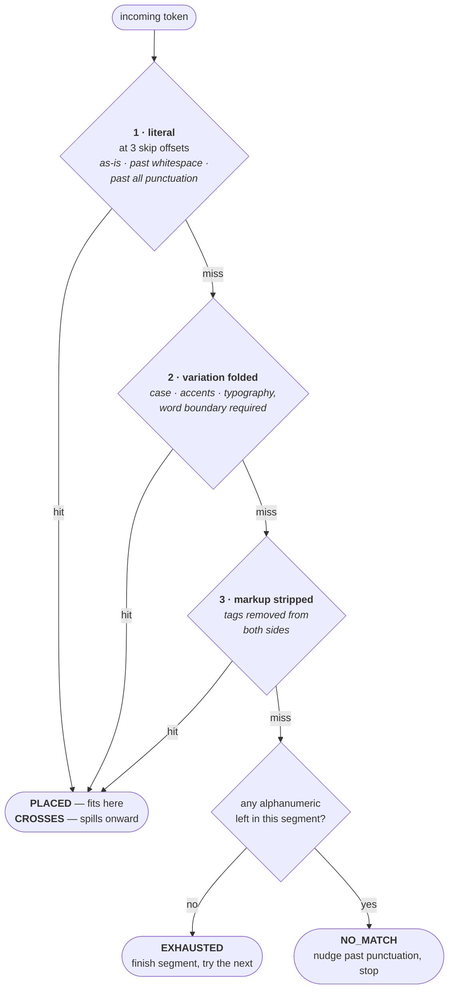

# TextSegmentMap

`src/pipecat/utils/context/text_segment_map.py`

> **Job:** given a word the TTS just spoke, say where we are in *all three* texts.

## 1. The problems

### 1.1 The spoken word does not appear in the original text

A provider tells you it just spoke `dollars`. Nothing in that event says which part of
`Your balance is $42.50` you have reached — **the word does not appear in that text at
all**.

Every transform opens the same gap:

| Transform | Original | Sent to TTS |
| --- | --- | --- |
| Currency expansion | `$42.50` | `forty-two dollars and fifty cents` |
| Number expansion | `room 1994` | `room 1 9 9 4` |
| SSML markup | `1234-5678` | `<spell>1234-5678</spell>` |
| URL cleanup | `https://pipecat.ai` | `pipecat.ai` |
| Pattern delimiters | `<card>4111</card>` | `4111` |

Without a mapping, **a consumer cannot tell where in the sentence the audio has reached** —
a UI has nothing to highlight, and a redaction filter has no split to redact around.

### 1.2 The context drifted from what the LLM wrote

The second problem is the one that silently degrades a bot over time. When an aggregator
splits a segment into content and delimiters — a `PatternPairAggregator` match yields
`text='4111'` alongside `raw_text='<card>4111</card>'` — only the content is synthesized.
If the context is then rebuilt from what the TTS spoke, **the tags vanish from the
conversation history**. The LLM sees a transcript where its own convention is absent and
stops producing it.

That is why the map tracks a *third* text. The two it compares are `tts_text` and
`original_text` (the **segment text** — see
[how the three texts are produced](./README.md#31-three-texts-produced-at-two-split-points));
`llm_text` rides along on its own cursor:

| Cursor | Text | Indexes |
| --- | --- | --- |
| `raw_pos` | `Your card is 4111` | The TTS text — the only cursor that really moves |
| `user_facing_pos` | `Your card is 4111` | The segment text — e.g. what the UI highlights |
| `llm_pos` | `Your card is <card>4111</card>` | The LLM text — what the conversation context records |

All three are **zero-based character indices**, and each points *just past* what has been
consumed: `text[:pos]` is everything spoken so far, `text[pos]` is the next character. A
cursor equal to `len(text)` therefore means finished. Character indices, not byte offsets
— `→` advances a cursor by 1, not by its 3 UTF-8 bytes.

Walking that example one word at a time, the two follower cursors stay together until the
tag appears, then part:

| word | `raw_pos` | `user_facing_pos` | `llm_pos` | LLM text consumed |
| --- | ---: | ---: | ---: | --- |
| `Your` | 4 | 4 | 4 | `Your` |
| `card` | 9 | 9 | 9 | `Your card` |
| `is` | 12 | 12 | 12 | `Your card is` |
| `4111` | 17 | 17 | **23** | `Your card is <card>4111` |

`llm_pos` jumps to 23 rather than 17 because it stepped over `<card>` on the way to the
digits. The opening tag is therefore attributed to the word `4111` and reaches the context
with it. (The closing tag is swept up by
[`WordCompletionTracker`](./word-completion-tracker.md) when the frame completes.)

Something has to translate a position in the spoken stream into a position in *both* other
texts. That is the entire job of `TextSegmentMap`.

### Why the third text needs no comparison

Only two of the three texts are ever compared against each other. `llm_text` is not, and
does not need to be, because of one fact about it:

> **`llm_text` holds the same letters and digits as `original_text`, in the same order.
> It differs only in what is wrapped around them** — tags, delimiters, punctuation.

So the map never has to find matching *positions* in `llm_text`; it only has to count.
Each time a word is spoken, it counts the letters and digits that word used up and moves
`llm_pos` past that many, stepping over any tags on the way for free.

**Where the two texts come from.** Both are fields of the same `AggregatedTextFrame`, and
the sequencer hands them over as `user_facing_text=frame.text` and
`llm_text=frame.raw_text or frame.text`:

| Field | Holds | Set by |
| --- | --- | --- |
| `text` | The content alone — `4111` | Every aggregation |
| `raw_text` | The content *with* its delimiters — `<card>4111</card>` | Only a `PatternMatch` |

That is what makes the premise hold today, in two steps:

1. **For an ordinary aggregation, the two are the same string.** `LLMTextProcessor` sets
   `raw_text=aggregation.text` for anything that is not a `PatternMatch`, so there is
   nothing to keep in step. This is the common case, including every
   `SimpleTextAggregator` sentence.
2. **For a `PatternMatch`, `raw_text` is `full_match`** — the regex match of
   start-delimiter + content + end-delimiter — while `text` is the content between them.
   Same characters, in the same order, with delimiters added around them.

**The condition step 2 rests on** is that a delimiter contributes no letters or digits of
its own. Tag-shaped delimiters satisfy it because `advance_by_alnums` crosses `<...>` for
free and `alnum_only` strips it; punctuation-only delimiters satisfy it because they have
no letters to begin with:

```
llm_text                    after speaking "hello world"
'<card>hello world</card>'  llm_pos=17  consumed '<card>hello world'
'**hello world**'           llm_pos=15  consumed '**hello world**'
```

## 2. Building the map: opcodes

At construction the map compares the TTS text against the original text using
`difflib.SequenceMatcher`, **at word level** (the text is tokenized on whitespace, keeping
the whitespace as tokens so offsets stay exact).

### What an opcode is

`SequenceMatcher` does not just say "these differ" — it returns a list of **opcodes**,
each one an instruction describing how a run of the original maps onto a run of the TTS
text. There are four kinds:

| Opcode | Meaning | Produced by |
| --- | --- | --- |
| `equal` | This run is identical on both sides | Any untouched text — the common case |
| `replace` | This run of the original was rewritten into that run of the TTS text | Every value transform and every added tag |
| `delete` | This run exists in the original but not in the TTS text | A filter that removes a whole word |
| `insert` | This run exists in the TTS text but not in the original | A transform that adds a whole word |

All four occur, and the code treats them the same way, so none is a special case.
`equal` and `replace` are by far the most common.

What that looks like for a currency expansion:

```
original = 'Your balance is $42.50'
tts      = 'Your balance is forty-two dollars and fifty cents'

   equal    original='Your balance is '   tts='Your balance is '
   replace  original='$42.50'             tts='forty-two dollars and fifty cents'
```

`delete` and `insert` produce a segment with one empty side; both are covered in
[Empty-sided segments](#empty-sided-segments).

Each opcode becomes one `TextSegment`, carrying both sides plus the span it occupies in
the original text:

```python
TextSegment(
    original="$42.50", tts="forty-two dollars and fifty cents", original_start=16, original_end=22
)
```

### Transformed vs unchanged segments

A segment is **transformed** (`TextSegment.is_transformed`) when **its two sides cannot be
followed together, character by character**. Three things trigger it:

1. The letters and digits differ (`$42.50` vs `forty-two dollars…`)
2. The number of words differs (a replacement changed how the text splits)
3. The TTS side contains a tag — even if the spoken words are identical

That third rule is why `<phoneme alphabet="ipa">Siobhan</phoneme>` counts as transformed:
the raw cursor must move through the tag characters while the original cursor stays put.

### Splitting markup into its own segment

Rule 3 has a cost. A segment holding *any* tag is all-or-nothing, so one tag in the middle
of otherwise identical text would hold the cursors still across the whole sentence. To
limit that, `_build_segments` cuts an `equal` opcode around the tags it carries, using
`split_markup_runs` from
[`pipecat.utils.text.markup_utils`](#5-the-two-markup-strippers):

```python
split_markup_runs("I love to count <spell>1234</spell>.")
# -> ["I love to count ", "<spell>1234</spell>."]
```

```
"I love to count "       plain           — cursors move word by word
"<spell>1234</spell>."   all-or-nothing  — lands as one when its last word arrives
```

Only `equal` opcodes can be split this way: both sides hold the same text, so a single
offset cuts both. The other kinds differ side to side, leaving no shared offset to cut at.

## 3. Walking the map: one cursor drives three

There is exactly one real cursor — `raw_pos`, the position reached in the TTS text.
`user_facing_pos` and `llm_pos` are derived from it:

- **Unchanged segment** — they move by a **count, not a position**: however many letters
  and digits the word used up on the TTS side is how many each of the other two cursors
  moves past.
- **Transformed segment** — they are *held* until the segment's entire TTS text is
  consumed, then **jump to the end of its original span in one step**. There is no
  meaningful position halfway through `$42.50`, so the map refuses to invent one.

  The count spent on that jump is the **original's** letters and digits, not the spoken
  one's: `llm_text` holds `$42.50` (four digits), never `forty-two dollars and fifty
  cents`. That is why `TextSegment` carries both `tts_alnum_count` and
  `original_alnum_count` — the two sides of a rewritten segment need different counts.

### Counting is what attaches tags to words

`advance_by_alnums` does the counting, and two of its rules are the whole reason the tag
behaviour in [§1.2](#12-the-context-drifted-from-what-the-llm-wrote) works:

- **A `<...>` tag is crossed for free**, without using up any of the count. The cursor
  ends up past the tag with its count untouched, so an opening tag travels with the word
  that follows it. This is why `llm_pos` reaches 23 rather than 17 in that section's
  table: `<card>` cost nothing, and four digits cost four.
- **Punctuation right after the count runs out is taken too**, stopping before the next
  space, letter, digit, or `<`. So a trailing `,` or `.` travels with the word *before*
  it — the provider reports `Yeah`, the context records `Yeah,`.

Nothing decides which words own which tags. One loop counts letters and digits and steps
over everything else; where the tags land simply follows from that. The closing tag is
the one thing the loop deliberately stops short of — it is swept up by
[`WordCompletionTracker`](./word-completion-tracker.md) when the frame completes.

### Worked example

```python
TextSegmentMap(
    tts_text="Your balance is forty-two dollars and fifty cents",
    original_text="Your balance is $42.50",  # frame.text — the segment text
    llm_text="Your balance is $42.50",  # frame.raw_text
)
```

Feeding the eight spoken words in one at a time:

| word | `raw_pos` | `user_facing_pos` | `llm_pos` | `in_transformed_segment` | segment text consumed |
| --- | ---: | ---: | ---: | --- | --- |
| `Your` | 4 | 4 | 4 | False | `Your` |
| `balance` | 12 | 12 | 12 | False | `Your balance` |
| `is` | 15 | 15 | 15 | False | `Your balance is` |
| `forty-two` | 25 | 15 | 15 | **True** | `Your balance is` |
| `dollars` | 33 | 15 | 15 | **True** | `Your balance is` |
| `and` | 37 | 15 | 15 | **True** | `Your balance is` |
| `fifty` | 43 | 15 | 15 | **True** | `Your balance is` |
| `cents` | 49 | **22** | **22** | False | `Your balance is $42.50` |

The raw cursor climbs steadily. **The other two freeze at 15 for four words, then jump
straight to 22** when the segment completes. `last_completed_segment` then reports the
`$42.50` segment — the signal callers use to attribute the whole original span to the word
that finished it.

Here `llm_text` and the segment text are the same string, so the last two columns move
together — the common case with the default `SimpleTextAggregator`. They diverge only when
an aggregator splits content from delimiters: with `llm_text="Your balance is
<price>$42.50</price>"`, `llm_pos` steps over the tags that `user_facing_pos` never sees.

### Empty-sided segments

A `delete` or `insert` opcode produces a segment with nothing on one side. Both count as
transformed, since their two sides differ, and both work out without any special case in
the code:

**`delete` — text that exists only in the original.** The segment's TTS side is empty, so
no word will ever arrive for it. It is finished as soon as the next word shows up, and its
original text is credited to that word:

```
tts='Hello world'   original='Hello there world'

  word='Hello'   user_facing_pos=5    'Hello'
  word='world'   user_facing_pos=17   'Hello there world'   ← 'there ' folded in here
```

The deleted word is never lost from the segment text or the context; it is simply never
spoken.

**`insert` — text that exists only in the TTS side.** The segment's original span is
empty (`original_start == original_end`), so the inserted word consumes raw text but
advances the other two cursors by nothing:

```
tts='Hello there world'   original='Hello world'

  word='Hello'   raw_pos=5    user_facing_pos=5
  word='there'   raw_pos=12   user_facing_pos=6    ← raw moves, original does not
  word='world'   raw_pos=17   user_facing_pos=11
```

## 4. Matching real provider tokens

The other half of the job: word-timestamp tokens are *messy*, and no two providers agree.
**Rather than special-casing each one**, `_classify_hop` matches the token against the
text left in the segment using three strategies, in order, stopping at the first hit. Each
one lives in its own method — `_literal_hop`, `_folded_hop`, `_markup_hop` — so
`_classify_hop` itself only decides the order and what to do when all three miss.



Every strategy also retries with the token's own trailing punctuation removed
(`_word_variants`), and the first two are offered three starting points into the segment
(`_match_candidates`): the text as it is, past any spaces, and past everything that is not
a letter or digit.

**The whole thing is stateless** — worked out fresh on every call, with no tag parsing and
nothing remembered between words.

### Which strategy fires, for real token shapes

| Provider behaviour | Segment remaining | Token | Strategy | Result |
| --- | --- | --- | --- | --- |
| Plain word | `hello world` | `hello` | 1 literal | `PLACED` (5 chars) |
| Token carries its own leading space (Inworld) | `" world"` | `" world"` | 1 literal | `PLACED` (6 chars) |
| Provider skipped punctuation it did not speak | `", I can help"` | `I` | 1 literal *(skip offset)* | `PLACED` (3 chars) |
| Provider added a terminal period | `account and more` | `account.` | 1 literal *(trailing trim)* | `PLACED` (7 chars) |
| Provider lowercased the word | `SQL is great` | `sql` | 2 folded | `PLACED` (3 chars) |
| Provider stripped a diacritic | `café open` | `cafe` | 2 folded | `PLACED` (4 chars) |
| Provider normalized an apostrophe | `don’t worry` | `don't` | 2 folded | `PLACED` (5 chars) |
| Token reported without its tags | `<spell>1234</spell> ok` | `1234` | 3 markup | `PLACED` (11 chars) |
| Token straddles the frame boundary | `1111` | `1111And` | 1 literal | `CROSSES` (4 chars used) |
| Foreign token (dropped event upstream) | `hello world` | `goodbye` | none | `NO_MATCH` |
| Nothing spoken left here | `<break/>` | `hello` | none | `EXHAUSTED` |

Note how strategy 1 alone covers four different provider quirks, because it tries three
starting points *and* a trailing-punctuation-trimmed form of the token.

Strategy 2 has one extra rule: because folding hides case, `account` would otherwise match
the start of `Accountant`, so a match there is only accepted if it ends where a word ends.
Strategy 1 needs no such guard, being case-sensitive already.

### The four outcomes

| Outcome | Meaning | Effect |
| --- | --- | --- |
| `PLACED` | Token fits inside this segment | Move to the end of the match, stop |
| `CROSSES` | This segment holds only the start of the token | Finish the segment, carry the **rest of the token** onward |
| `EXHAUSTED` | Nothing here can be spoken | Finish the segment, carry the **whole token** onward |
| `NO_MATCH` | Token does not belong here | Step past leading punctuation, stop |

Each outcome is returned as a `_Hop`, carrying two numbers: `segment_advance`, how far to
move in this segment, and `word_consumed`, how much of the token this segment used up.

`PLACED` and `NO_MATCH` end the walk. **`CROSSES` and `EXHAUSTED` do not** — they finish
the current segment and move to the next one, where the token is matched again from
scratch. The difference between them is only **how much of the token survives the hop**.

The walk itself is worked out by `_plan_hops`, which decides what every segment would
answer without moving anything. `_consume_word` then applies those answers, and
`_can_consume_word` (the dry run behind `word_belongs_current_segment`) just reads the
last one. Both go through the same walk, so the dry run cannot disagree with the real one.

**`CROSSES` — the token outlives the segment.** A provider that merges two words into one
token produces this. The segment's remaining text is consumed as a prefix of the token,
the segment completes (jumping the cursors, since it is now finished), and the unmatched
tail is re-classified against the next segment:

```
tts='Hello five'   original='Hello 5'
  seg0: 'Hello '  (unchanged)
  seg1: '5' → 'five'  (transformed)

  token 'Hello five'
    ├─ seg0: CROSSES, 6 chars consumed → seg0 completes, remainder 'five'
    └─ seg1: PLACED  → seg1 completes, user_facing_pos jumps to 7 ('Hello 5')
```

One incoming token therefore completed two segments and moved the segment-text cursor
across a transform, in a single `advance_word` call.

**`EXHAUSTED` — the segment has nothing to give.** No letters or digits are left to speak
here (a `delete` opcode's empty side, a self-closing `<break/>`, or only trailing spaces),
so no word will ever match it. The segment is finished and the *entire* token — none of it
was used — moves to the next segment:

```
tts='Hello world'   original='Hello there world'
  seg1: 'there ' → ''   (delete opcode, nothing to speak)

  token 'world'
    ├─ seg1: EXHAUSTED, 0 chars consumed → seg1 completes, token unchanged
    └─ seg2: PLACED  → 'world' lands, user_facing_pos jumps past 'there ' too
```

If a `CROSSES` remainder runs out of segments entirely, the leftover is exposed as
`last_overflow` — that is the straddling-token case the frame above handles.

### Symbol tokens: the dry run accepts what the walk will not place

A token with no letters or digits in it at all — an emoji, a bare punctuation mark, or a
symbol the provider swapped for another (ElevenLabs reports `→` as `-`) — cannot be
matched by any of the three strategies, because there is nothing to compare.
`word_belongs_current_segment` falls through to a separate check, `_symbol_belongs_here`,
which accepts the token when either:

1. it appears as-is in the text still to be spoken (the search starts a little before the
   cursor, since punctuation is often taken along with the word before it), or
2. words remain to be spoken **and** the next thing in the text is itself a symbol — the
   swap case, where the reported symbol will never match the character it stands for.

`advance_word` does **not** consult this path. A substituted symbol therefore passes
`word_belongs_here` — so the slot is not force-completed over it — and then classifies as
`NO_MATCH`, nudging the raw cursor past leading punctuation and stopping. The token is
accepted without being placed, which is the right outcome for a mark the source text
spells differently.

Feeding a provider's tokens for `Step one → step two`, where the arrow is reported as `-`:

| token | `word_belongs_…` | outcome | `raw_pos` | `user_facing_pos` |
| --- | --- | --- | ---: | ---: |
| `Step` | True | `PLACED` | 4 | 4 |
| `one` | True | `PLACED` | 8 | 8 |
| `-` | **True** | **`NO_MATCH`** | **11** | **8** |
| `step` | True | `PLACED` | 15 | 15 |
| `two` | True | `PLACED` | 19 | 19 |

The `-` is accepted but never placed. On its row the raw cursor moves from 8 to 11,
stepping over ` → ` so the next token is not blocked by it, while `user_facing_pos` holds
at 8 — nothing the source text spells was actually spoken. `step` then lands normally and
the frame completes.

Spelling out what each `raw_pos` above points at:

```
  pos= 4  consumed='Step'                 next char=' '
  pos= 8  consumed='Step one'             next char=' '
  pos=11  consumed='Step one → '          next char='s'
  pos=15  consumed='Step one → step'      next char=' '
  pos=19  consumed='Step one → step two'  next char=(end)
```

Had the dry run rejected `-`, the caller would have read that as a dropped event and
force-completed the frame. No text would be lost — `_force_complete` emits the entire
unspoken remainder at once — but `→ step two` would arrive as a single lump attributed to
the `-`, instead of `step` and `two` arriving as their own timed words.

### Trimming a token to what it actually covers

The raw cursor stops *before* punctuation trailing a word, so the next token can still
match it. `advance_by_alnums` meanwhile sweeps that same mark into the preceding word's
span. The two conventions differ by exactly one character:

```
"Yeah, I can do that."   after advance_word("Yeah")
   raw_pos = 4    ← before the comma, so ", I" can still match here
   llm_pos = 5    ← after it, swept into Yeah's span
```

Both are deliberate, and the gap is visible whenever a provider reports the mark leading
the *following* token (`, I` rather than `I`) — it would then be carried twice.
`last_leading_duplicate` reports how many of the token's leading characters to drop,
positionally: the token's leading punctuation run, when `llm_pos` has just moved past
exactly that mark.

| after | token | `last_leading_duplicate` | |
| --- | --- | ---: | --- |
| `Yeah` (span `Yeah,`) | `, I` | **2** | the comma and its space |
| `Yeah` (span `Yeah,`) | `I` | 0 | nothing repeated |
| `Yeah` (span `Yeah,`) | `, ` | 0 | the mark as its own event stands for this position |
| `He said` | `"hello` | 0 | the quote is content, not yet passed |

It is the mirror of [`last_overflow`](#the-four-outcomes): one reports the head of the
token that is not this frame's, the other the tail. Callers keep what is between them.

## 5. The two markup strippers

These are not in this file — they live in `src/pipecat/utils/text/markup_utils.py`,
shared so that every part of the codebase decides what counts as a tag the same way. Two
of them matter here, and they treat a lone `<` in **opposite** ways:

| Function | Input | `5 < 10` becomes | Used by |
| --- | --- | --- | --- |
| `strip_markup` | A token that may be cut off mid-tag | `5 ` | `_markup_hop` |
| `strip_complete_markup` | A whole, finished text | `5 < 10` | `is_transformed`, default segment text |

Each is only ever applied where its assumption holds, so the disagreement never bites.
Provider tokens really can end mid-tag — some providers split `<phoneme alphabet="ipa"`
across two word-timestamp events — and there a trailing `<` is an unfinished tag. Texts we
assembled ourselves are never cut off, so there a lone `<` is content the LLM wrote:
`5 < 10`, `I <3 this`, `List<int>`. Swallowing the rest of the sentence would silently
drop real text.

## 6. Public surface

| Member | Purpose |
| --- | --- |
| `advance_word(word)` | Consume one token, moving all cursors |
| `word_belongs_current_segment(word)` | Non-mutating dry run, plus the symbol check `advance_word` skips |
| `user_facing_pos` / `llm_pos` / `raw_pos` | The three cursors (`user_facing_pos` indexes the segment text) |
| `is_complete` | Every letter and digit has been spoken |
| `in_transformed_segment` | Cursor sits mid-transform (callers suppress context writes) |
| `last_completed_segment` | Segment finished by the last `advance_word` |
| `last_overflow` | Raw suffix that ran past the end of the TTS text |
| `last_leading_duplicate` | Leading chars of the token already carried by the previous word |
| `reset()` | Rewind every cursor, keep the segments |

Two details in `is_complete` are worth knowing. A frame whose remaining text is nothing
but punctuation or tags already counts as complete, because a closing tag never arrives as
its own token. The exception is punctuation set off by a space, as French writes
`Comment ça va ?` — that *does* arrive as its own token, so
`_pending_separated_punctuation` keeps the frame open until it does.

## 7. Tests

`tests/test_text_segment_map.py` — 54 tests.

| Class | Covers |
| --- | --- |
| `TestTextSegmentMapBuild` | Segment construction and spans |
| `TestTextSegmentMapAdvance` | Cursors holding and jumping |
| `TestTextSegmentMapWithLlmText` | The third cursor |
| `TestTextSegmentMapReset` | Rewind and replay |
| `TestTextSegmentMapEqualTexts` | The no-transform case |
| `TestTextSegmentMapTokenChangingReplacements` | Replacements that change the word count |
| `TestTextSegmentMapSsmlPhonemeTag` | Tag segments |
| `TestTextSegmentMapStrayAngleBracket` | A lone `<` as content |
| `TestClassifyHopLiteralMatchHandlesStrayAngleBracket` | Which strategy matched a `<` |
| `TestClassifyHopSkipsLeadingPunctuation` | The three starting points |
| `TestClassifyHopCaseFoldRequiresWordBoundary` | The `account` / `Accountant` guard |
| `TestClassifyHopFoldsTypographicVariants` | Quotes and dashes |
| `TestFoldPreservesLength` | Folding never changes a string's length |
| `TestProviderTokenShapes` | Tokens carrying their own spacing |
| `TestWordCarriesItsOwnPunctuation` | Provider-added terminal punctuation |
| `TestLeadingDuplicatePunctuation` | A mark reported with the following word |

`tests/test_markup_utils.py` — 20 tests, covering the shared helpers this file leans on.

| Class | Covers |
| --- | --- |
| `TestStripMarkupHelpers` | `strip_markup` and the `raw_offset_after_clean_chars` round-trip |
| `TestStripCompleteMarkupHelper` | A lone `<` kept as content |
| `TestSplitMarkupRuns` | Giving a tag its own run |
| `TestHasAlnum` | `has_alnum` agreeing with `alnum_only`, tags included |
