# A Frame's Progress

1. A user says “Hello, LLM” and the cloud transcription service delivers a transcription to the Transport.
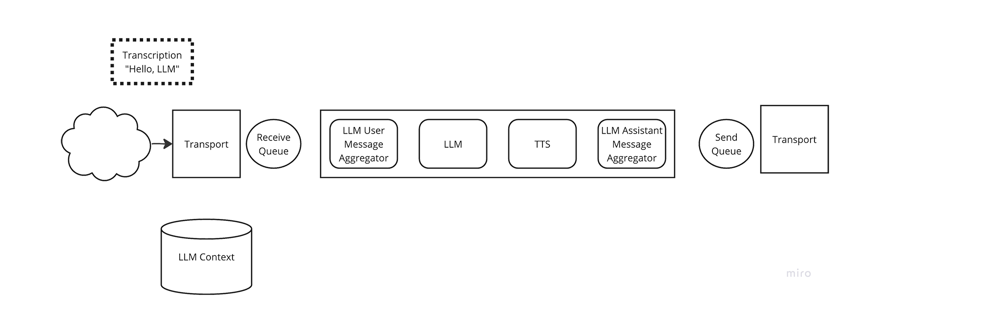

2. The Transport places a Transcription frame in the Pipeline’s source queue.
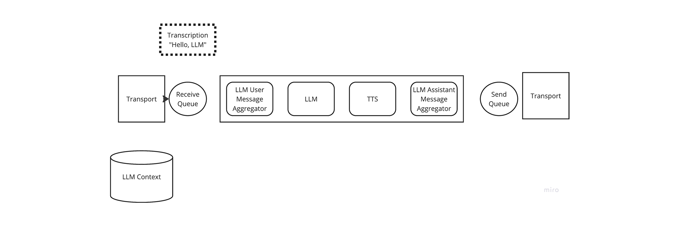

3. The Pipeline passes the Transcription frame to the first Frame Processor in its list, the LLM User Message Aggregator.
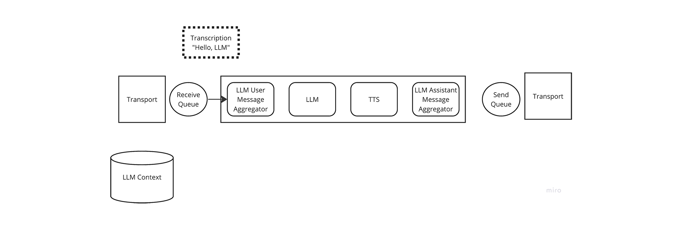

4. The LLM User Message Aggregator updates the LLM Context with a `{“user”: “Hello LLM”}` message.
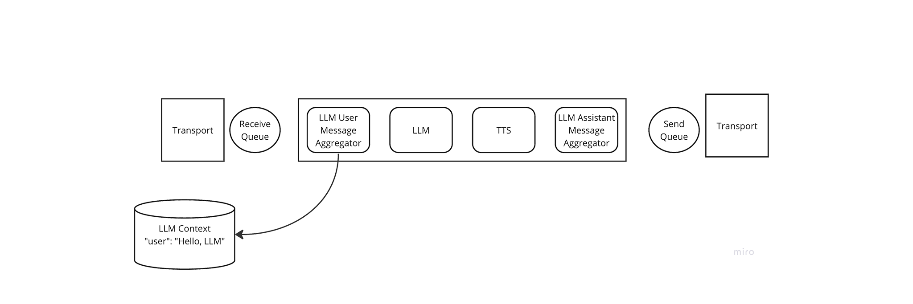

5. The LLM User Message Aggregator yields an LLM Message Frame, containing the updated LLM Context. The Pipeline passes this frame to the LLM Frame Processor.
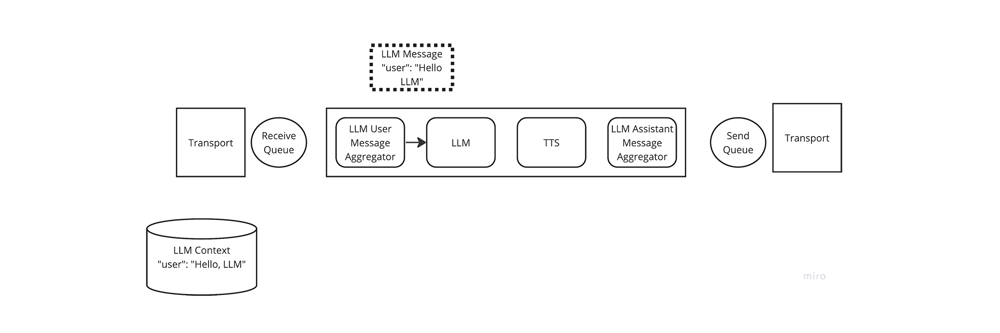

6. The LLM Frame Processor creates a streaming chat completion based on the LLM context and yields the first chunk of a response, Text Frame with the value “Hi, “. The Pipeline passes this frame to the TTS Frame Processor. The TTS Frame Processor aggregates this response but doesn’t yield anything, yet, because it’s waiting for a full sentence.
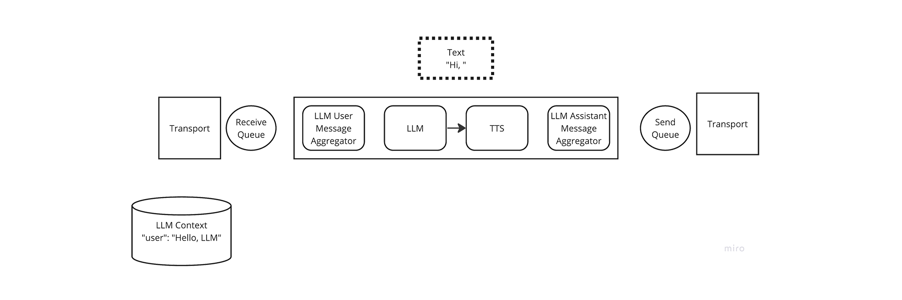

7. The LLM Frame Processor yields another Text Frame with the value “there.”. The Pipeline passes this frame to the TTS Frame Processor.
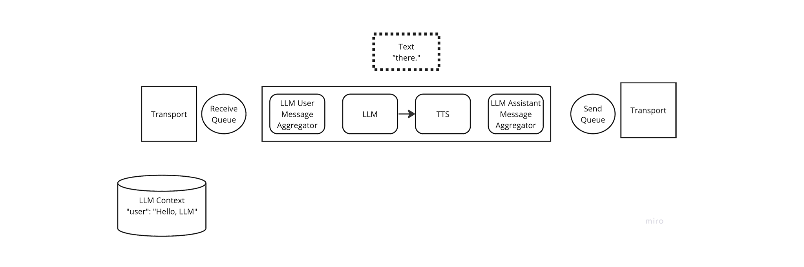

8. The TTS Frame Processor now has a full sentence, so it starts streaming audio based on “Hi, there.” It yields the first chunk of streaming audio as an Audio frame, which the Pipeline passes to the LLM Assistant Message Aggregator.
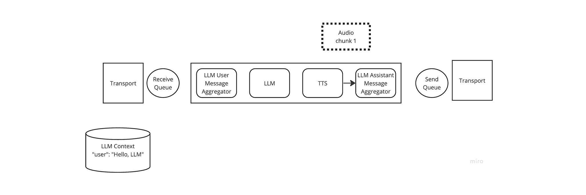

9. The LLM Assistant Message Aggregator doesn’t do anything with Audio frames, so it immediately yields the frame, unchanged. This is the convention for all Frame Processors: frames that the processor doesn’t process should be immediately yielded.
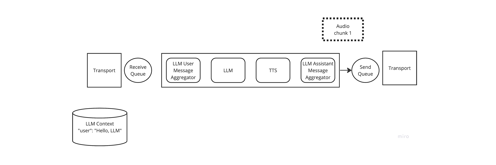

10. The Pipeline places the first Audio frame in its sink queue, which is being watched by the Transport. Since the frame is now in a queue, the Pipeline can continue processing other frames. Note that the source and sink queues form a sort of “boundary of concurrent processing” between a Pipeline and the outside world. In a Pipeline, Frames are processed sequentially; once a Frame is on a queue it can be processed in parallel with the frames being processed by the Pipeline. TODO: link to a more in-depth section about this.
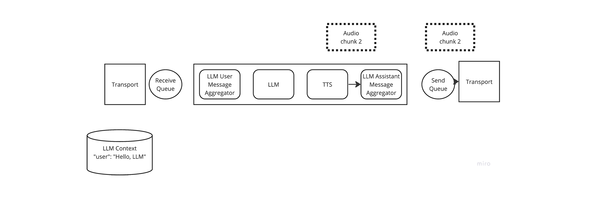

11. The TTS Frame Processor yields another Audio frame as the Transport transmits the first Audio frame.
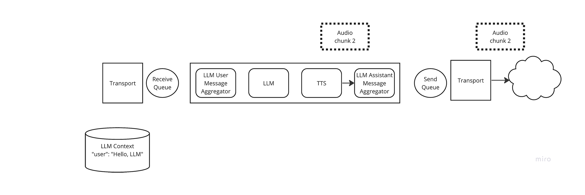

12. As before, the LLM Assistant Message Aggregator immediately yields the Audio frame and the Pipeline places the Audio frame in the sink queue.
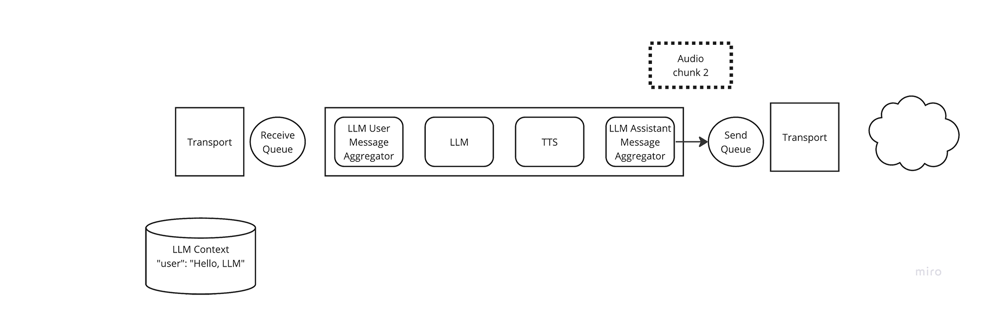

13. The TTS Frame Processor has no more frames to yield. The LLM Frame Processor emits an LLM Response End Frame, which the Pipeline passes to the TTS Frame Processor.
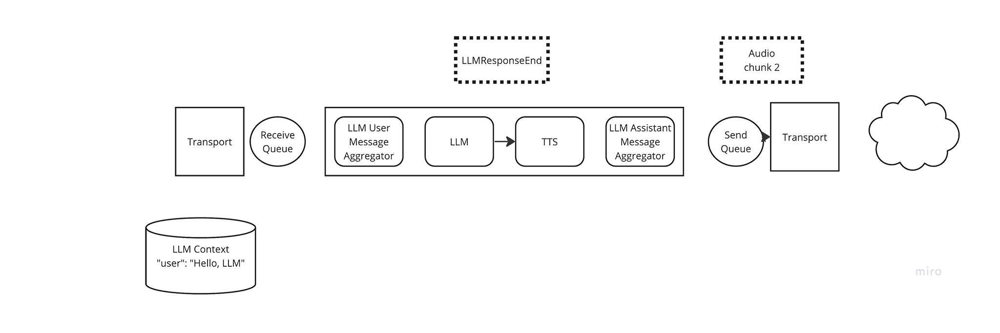

14. The TTS Frame Processor immediately yields the LLM Response End Frame, so the Pipeline passes it along to the LLM Assistant Message Aggregator. The LLM Assistant Message Aggregator updates the LLM Context with the full response from the LLM. TODO TODO: I realized I forgot that the TSS Frame Processor also yields the Text frames that the LLM emitted so that the LLM Assistant Message Aggregator could accumulate them, arrggh.
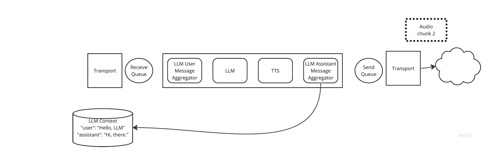

15. The system is quiet, and waiting for the next message from the Transport.
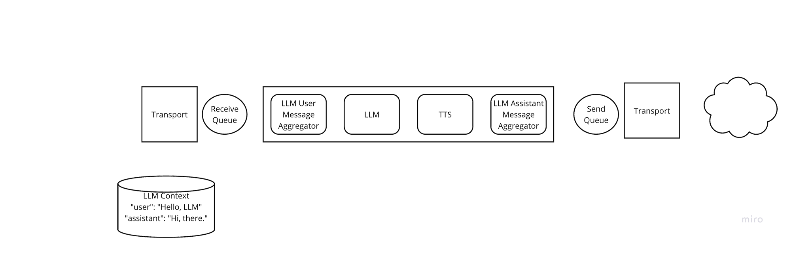
