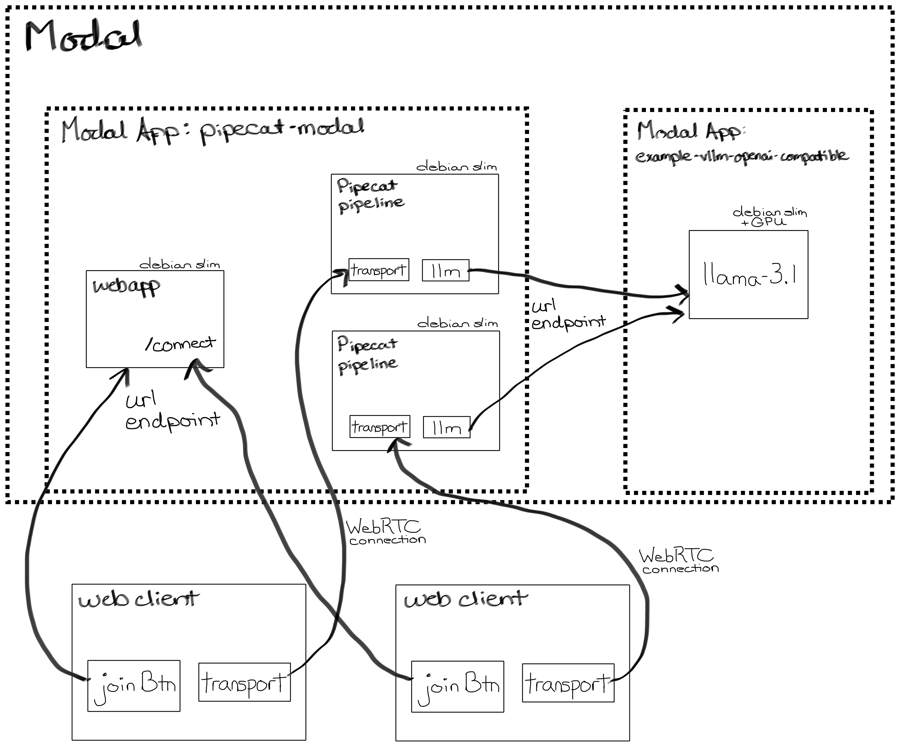

# Deploying Pipecat to Modal.com

Deployment example for [modal.com](https://www.modal.com). This example demonstrates how to deploy a FastAPI webapp to Modal with an RTVI compatible `/connect` endpoint that launches a Pipecat pipeline in a separate Modal container and returns a room/token for the client to join. This example also supports providing a parameter to the `/connect` endpoint for specifying which Pipecat pipeline to launch; openai, gemini, or vllm. The vllm pipeline points to a self-hosted OpenAI compatible LLM, using a llama model (neuralmagic/Meta-Llama-3.1-8B-Instruct-quantized.w4a16), deployed to Modal.



# Running this Example

## Install the Modal CLI

Setup a Modal account and install it on your machine if you have not already, following their easy 3 steps in their [Getting Started Guide](https://modal.com/docs/guide#getting-started)

## Deploy a self-serve LLM

1. Deploy Modal's OpenAI-compatible LLM service:

   ```bash
   git clone https://github.com/modal-labs/modal-examples
   cd modal-examples
   modal deploy 06_gpu_and_ml/llm-serving/vllm_inference.py
   ```

   Refer to Modal's guide and example for [Deploying an OpenAI-compatible LLM service with vLLM](https://modal.com/docs/examples/vllm_inference) for more details.

2. Take note of the endpoint URL from the previous step, which will look like:
   ```
   https://{your-workspace}--example-vllm-openai-compatible-serve.modal.run
   ```
   You'll need this for the `bot_vllm.py` file in the next section.

    **Note:**  The default Modal LLM example uses Llama-3.1 and will shut down after 15 minutes of inactivity. Cold starts take 5-10 minutes. To prepare the service, we recommend visiting the `/docs` endpoint (`https://<Modal workspace>--example-vllm-openai-compatible-serve.modal.run/docs`) for your deployed LLM and wait for it to fully load before connecting your client.

## Deploy FastAPI App and Pipecat pipeline to Modal 

1. Setup environment variables

   ```bash
   cd server
   cp env.example .env
   # Modify .env to provide your service API Keys
   ```

   Alternatively, you can configure your Modal app to use [secrets](https://modal.com/docs/guide/secrets)

2. Update the `modal_url` in `server/src/bot_vllm.py` to point to the url produced from the self-serve llm deploy, mentioned above.

3. From within the `server` directory, test the app locally:

   ```bash
   modal serve app.py
   ```

4. Deploy to production

   ```bash
   modal deploy app.py
   ```

5. Note the endpoint URL produced from this deployment. It will look like:

   ```bash
   https://{your-workspace}--pipecat-modal-fastapi-app.modal.run
   ```

   You'll need this URL for the client's `app.js` configuration mentioned in its README.

## Launch your bots on Modal

### Option 1: Direct Link

Simply click on the url displayed after running the server or deploy step to launch an agent and be redirected to a Daily room to talk with the launched bot. This will use the OpenAI pipeline.

### Option 2: Connect via an RTVI Client

Follow the instructions provided in the [client folder's README](client/javascript/README.md) for building and running a custom client that connects to your Modal endpoint. The provided client provides a dropdown for choosing which bot pipeline to run.

# Navigating your llm, server, and Pipecat logs

In your [Modal dashboard](https://modal.com/apps), you should have two Apps listed under Live Apps:

1. `example-vllm-openai-compatible`: This App contains the containers and logs used to run your self-hosted LLM. There will be just one App Function listed: `serve`. Click on this function to view logs for your LLM.
2. `pipecat-modal`: This App contains the containers and logs used to run your `connect` endpoints and Pipecat pipelines. It will list two App Functions:
    1. `fastapi_app`: This function is running the endpoints that your client will interact with and initiate starting a new pipeline (`/`, `/connect`, `/status`). Click on this function to see logs for each endpoint hit.
    2. `bot_runner`: This function handles launching and running a bot pipeline. Click on this function to get a list of all pipeline runs and access each run's logs.

# Modal + Pipecat Tips

- In most other Pipecat examples, we use `Popen` to launch the pipeline process from the `/connect` endpoint. In this example, we use a Modal function instead. This allows us to run the pipelines using a separately defined Modal image as well as run each pipeline in an isolated container.
- For the FastAPI and most common Pipecat Pipeline containers, a default `debian_slim` CPU-only should be all that's required to run. GPU containers are needed for self-hosted services.
- To minimize cold starts of the pipeline and reduce latency for users, set `min_containers=1` on the Modal Function that launches the pipeline to ensure at least one warm instance of your function is always available.
- For next steps on running a self-hosted llm and reducing latency, check out all of [Modal's LLM examples](https://modal.com/docs/examples/vllm_inference).
