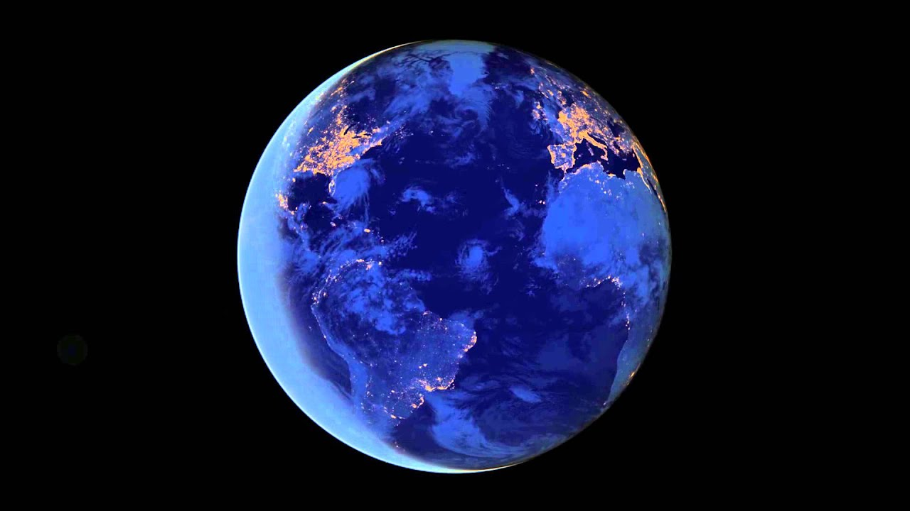

# Planet Explorer - Hand Gesture-Controlled 3D Globe

This is an interactive 3D globe application that uses hand gestures to navigate around Earth. Users can control zoom and rotation through pinch gestures with their hands.

[Video](https://youtu.be/s7_0iBvSe14) | [Live Demo](https://www.funwithcomputervision.com/planet-explorer/)

## Project Overview

### `index.html`
- Main HTML structure and configuration
- Includes Cesium.js for 3D globe rendering and MediaPipe for hand tracking
- Contains UI elements: layer controls, instructions panel, and logo
- Sets up meta tags for social sharing and analytics

### `main.js` (Core Application Logic)
- **Hand Tracking**: Uses MediaPipe to detect hand landmarks and pinch gestures
- **Globe Control**: 
  - Left hand pinch + vertical movement = zoom in/out
  - Right hand pinch + drag = rotate/pan the globe
- **Map Layers**: Three selectable base maps (terrain, streets, dark mode)
- **Safety Systems**: Extensive bounds checking and error handling to prevent crashes
- **Visual Feedback**: Draws hand landmarks on canvas overlay with gesture indicators

### `styles.css`
- Responsive design with full viewport coverage
- Retro-style UI design

## Key Technical Structure

**Core Flow:**
1. Initialize webcam → MediaPipe hands → Cesium globe
2. Process hand landmarks → detect pinch gestures → smooth movements
3. Update camera position with safety bounds → render globe + country labels

**Other Notes:**
- Uses exponential smoothing on the hand landmark positions to prevent jarring movements
- Uses fallback positions when hand tracking errors occur

### Country Info Hover
- **Functionality**: Hovering the right-hand index finger over a country displays an information box with its flag, name, capital, population, currency, and region
- **Technical Implementation**:
  - The application uses `viewer.scene.pick` to detect the geographical entity under the user's index finger
  - On hover, it fetches detailed country data from the [REST Countries API](https://restcountries.com/)