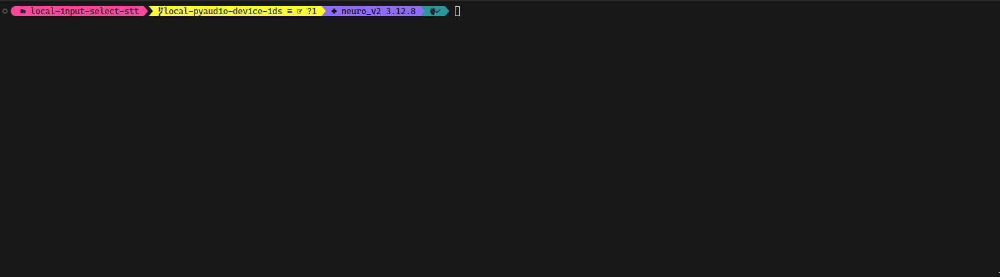

# Pipecat Audio Transcription Example 🚀🎙️

Welcome to the **Pipecat Audio Transcription Example**! 

This project showcases how to integrate the awesome [pipecat](https://github.com/pipecat-ai/pipecat) library with a neat textual interface (powered by [Textual](https://github.com/Textualize/textual)) to select audio devices, perform real-time speech-to-text (STT) transcription using [Whisper](https://github.com/openai/whisper).

> **Note:** Although the script allows you to select both input and output audio devices, this example only utilizes the audio **input** for transcription.

---

## 🎉 Features

- **Interactive Audio Device Selection:**  
  Choose your preferred audio input device using a cool, textual UI.
  
- **State-of-the-Art Transcription:**  
  Leverage Whisper's large model (running on CUDA) for high-quality, real-time STT.
  
- **Live Transcription Logging:**  
  Watch your spoken words transform into text on your console instantly.
  
- **Easy Setup:**  
  Everything you need is in the [`requirements.txt`](./requirements.txt).

---

## 🎥 Demo

Get a quick glimpse of the app in action!  
*(Don't worry – I'll be adding a GIF demo here soon!)*



---

## 🔧 Installation


Install Dependencies:

```bash
pip install -r requirements.txt
```


---

## 🚀 Usage

Run the main script:

```bash
python bot.py
```

When the app launches, you'll see a textual interface that lets you select your audio input device. Once selected, the app will begin capturing audio, transcribing it using Whisper.

---

## ⚙️ How It Works


1. **LocalAudioTransport:**  
   Captures audio from your chosen input device.
   
2. **WhisperSTTService:**  
   Processes the audio stream using Whisper's large model for speech-to-text conversion.
   
3. **TranscriptionLogger:**  
   Logs the transcribed text to the console as soon as it's processed.


---

## 📦 Dependencies

The project relies on:

- [pipecat](https://github.com/yourusername/pipecat) – For building the audio processing pipeline.
- [Textual](https://github.com/Textualize/textual) – For the interactive terminal UI.
- [Whisper](https://github.com/openai/whisper) – For state-of-the-art STT transcription.

---

## Example improvements:

I plan to improve this example with local LLM calls and audio output.
