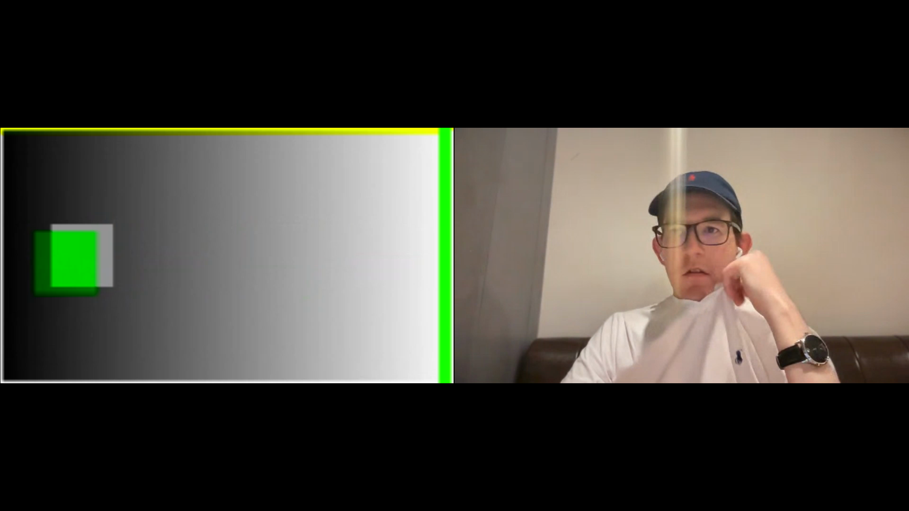
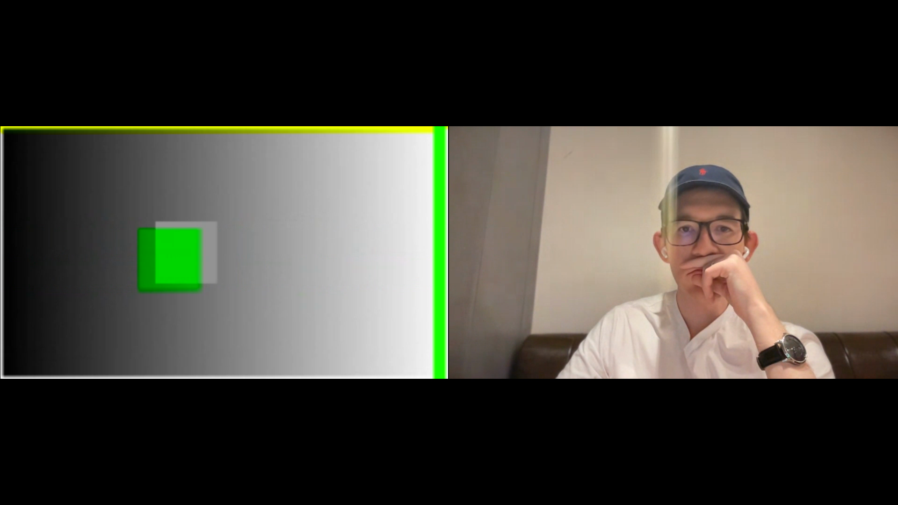
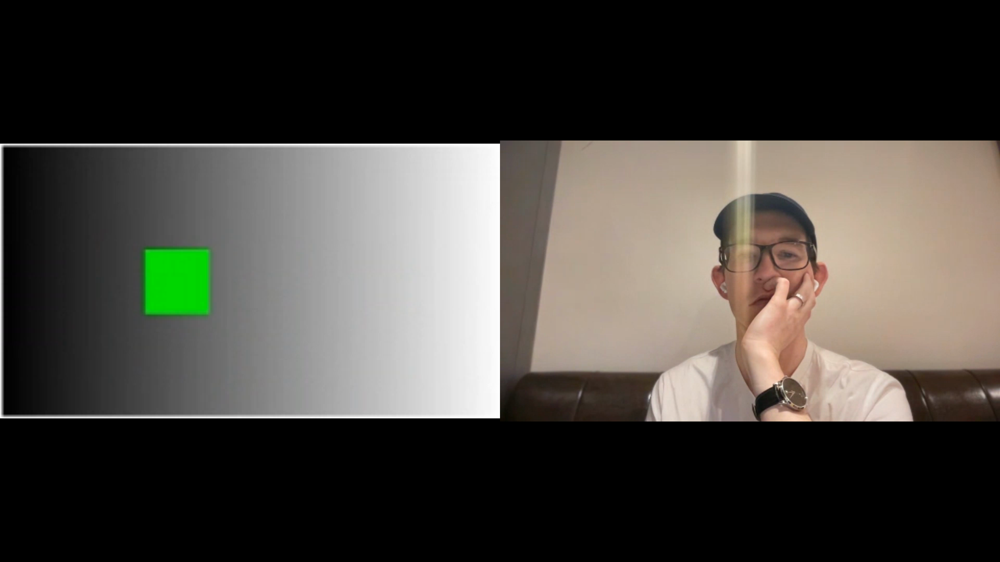

# Odd-resolution cloud recording repro

Minimal repro for the recording corruption bug in the new compositor
(STR-2062). A bot publishes a 300x169 video track (odd height, not a multiple
of 16) into a Daily room and makes a 30 second cloud recording of itself.

The live call looks fine. The recorded MP4 shows red border artifacts and
contrast shifts when the recording runs on the new GST VCS render pipeline
(`enableGstVcsRenderPipeline`, the platform default since 2026-05-28).

## Run

```bash
pip install "pipecat-ai[daily]" pillow python-dotenv
export DAILY_API_KEY=...   # a domain WITHOUT enable_legacy_compositor=true

# Repro: odd height (expect corruption in the recording)
python bot.py

# Control: even, mod-16 dimensions (expect a clean recording)
VIDEO_WIDTH=320 VIDEO_HEIGHT=176 python bot.py
```

The bot creates its own room (with `enable_recording: cloud`), joins, starts
the recording, records for `RECORD_SECONDS` (default 30), stops, and exits.
It logs the room URL: open it while it runs to confirm the live video is clean.

## Check the result

Download both recordings from the Daily dashboard (Recordings page) and
compare:

- 300x169 run: red horizontal/vertical borders and contrast shifts on the
  bot tile.
- 320x176 run: clean.

The gray gradient background makes contrast shifts obvious; the white border
makes edge artifacts obvious.

## Comparison frames

300x169 (corrupt): green/yellow border bars and a ghosted double image on
the moving box.




320x176 (clean control):



## Why these numbers

The recordings are I420 (4:2:0), where chroma planes are half the height. An
odd height like 169 forces padded plane sizes and unusual strides, which the
new compositor mishandles. 320x176 is the nearest mod-16 size, which is safe.
