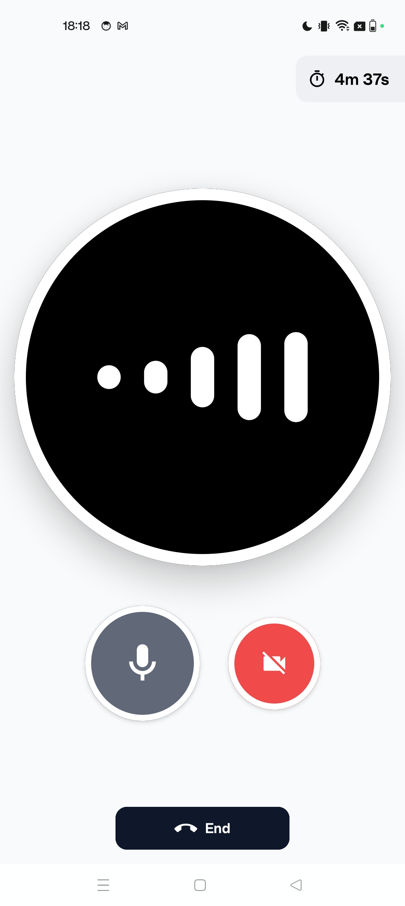

# Pipecat Simple Chatbot Client for Android

Demo app which connects to the `simple-chatbot` backend over RTVI.

## Screenshot



## How to run

```bash
./gradlew runDebug
```

Ensure that the `simple-chatbot` server is running as described in the parent README.

For a full walkthrough, describing how to set up the backend and forward the connection
to your Android device, please see the following blog post:

https://www.daily.co/blog/build-a-voice-agent-for-android-with-gemini-multimodal-live/
