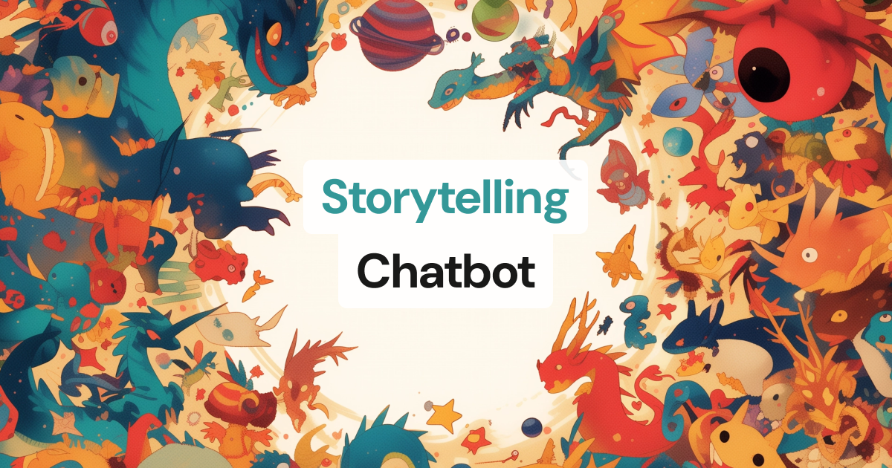

[](https://gemini-storybot.vercel.app/)

# Storytelling Chatbot



This example shows how to build a voice-driven interactive storytelling experience.
It periodically prompts the user for input for a 'choose your own adventure' style experience.

We use Gemini 2.0 for creating the story and image prompts, and we add visual elements to the story by generating images using Google's Imagen.

---

### It uses the following AI services:

**Deepgram - Speech-to-Text**

Transcribes inbound participant voice media to text.

**Google Gemini 2.0 - LLM**

Our creative writer LLM. You can see the context used to prompt it [here](server/prompts.py)

**ElevenLabs - Text-to-Speech**

Converts and streams the LLM response from text to audio

**Google Imagen - Image Generation**

Adds pictures to our story. Prompting is quite key for style consistency, so we task the LLM to turn each story page into a short image prompt.

---

## Setup

### Client

1. Navigate to the client directory:

   ```shell
   cd client
   ```

2. Install dependencies:

   ```shell
   npm install
   ```

3. Build the client:

   ```shell
   npm run build
   ```

### Server

1. Navigate to the server directory

   ```shell
   cd ../server
   ```

2. Set up your virtual environment and install requirements

   ```shell
   python3 -m venv venv
   source venv/bin/activate
   pip install -r requirements.txt
   ```

3. Create environment file and set variables

   ```shell
   mv env.example .env
   ```

   You'll need API keys for:

   - DAILY_API_KEY
   - ELEVENLABS_API_KEY
   - ELEVENLABS_VOICE_ID
   - GOOGLE_API_KEY

4. (Optional) Deployment:

   When deploying to production, to ensure only this app can spawn new bot processes, set your `ENV` to `production`

## Run it locally

1. Navigate back to the demo's root directory:

   ```shell
   cd ..
   ```

2. Run the application:

   ```shell
   python server/bot_runner.py --host localhost
   ```

   You can run with a custom domain or port using: `python server/bot_runner.py --host somehost --p someport`

3. ➡️ Open the host URL in your browser: http://localhost:7860

---

## Improvements to make

- Wait for track_started event to avoid rushed intro
- Show 5 minute timer on the UI
