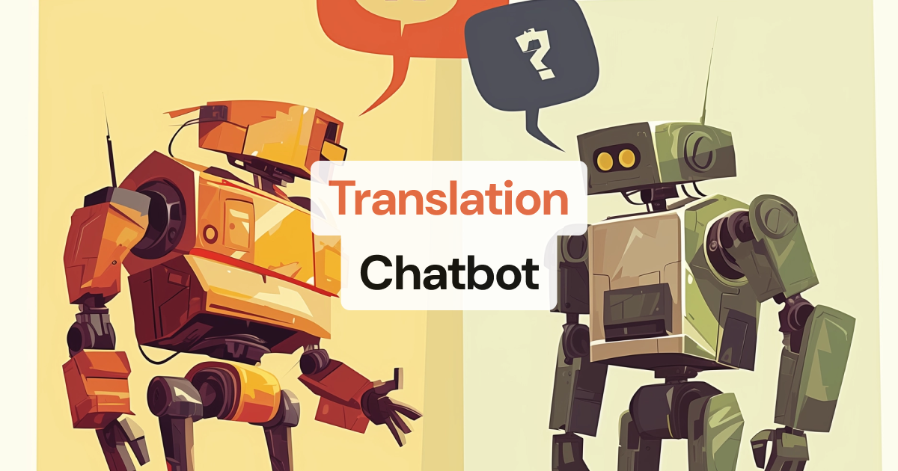

# Translation Chatbot



This app listens for user speech, then translates that speech to Spanish and speaks the translation back to the user using text-to-speech. It's probably most useful with multiple users talking to each other, along with some manual track subscription management in the Daily call.

See a quick video walkthrough of the code here: https://www.loom.com/share/59fdddf129534dc2be4dde3cc6ebe8de

## Get started

```python
python3 -m venv venv
source venv/bin/activate
pip install -r requirements.txt

cp env.example .env # and add your credentials

```

## Run the server

```bash
python server.py
```

Then, visit `http://localhost:7860/` in your browser to start a translatorbot session.

## Build and test the Docker image

```
docker build -t chatbot .
docker run --env-file .env -p 7860:7860 chatbot
```
