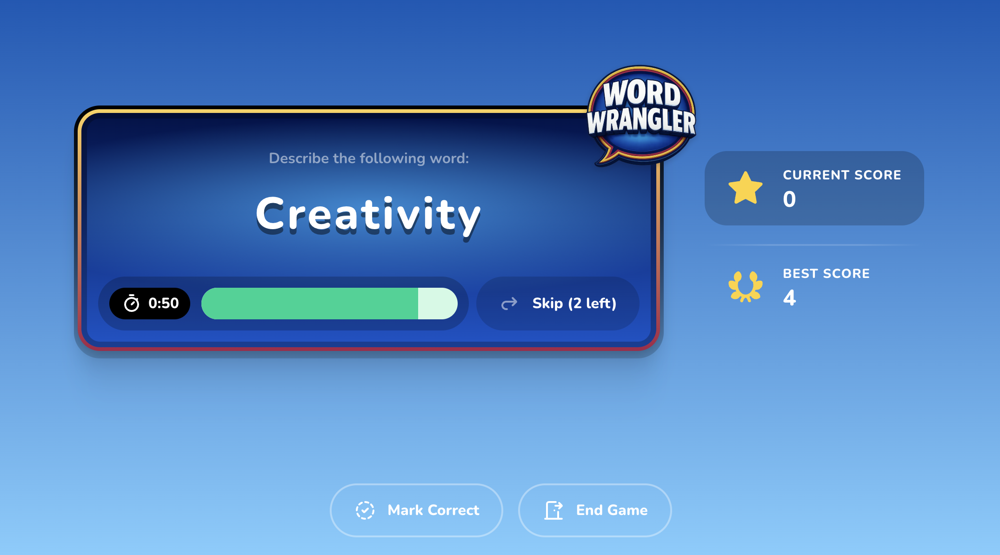
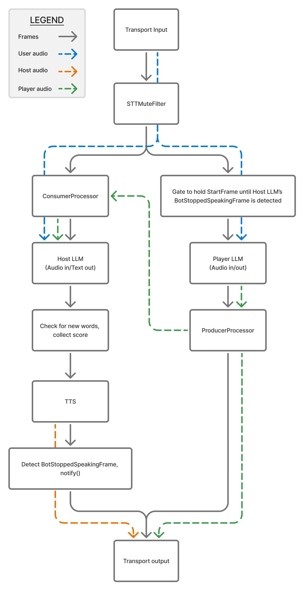

# Word Wrangler

Word Wrangler is a voice-based word guessing game powered by [Pipecat](https://github.com/pipecat-ai/pipecat) and the [Gemini Live API](https://ai.google.dev/gemini-api/docs/live). The game is available in two versions: a web-based experience and a phone-based experience. Test your description skills in this AI-powered twist on classic word games!

## Game Modes

### Web-Based Game

In this version, you provide the words, and an AI player attempts to guess them based on your descriptions.

**Try it now:** https://word-wrangler.vercel.app



### Phone-Based Game

In this three-way conversation, an AI host provides words, you describe them without saying the actual word, and an AI player tries to guess. The host tracks your score and manages game flow.

**Try it now:** Call +1-929-**LLM-GAME** (+1-929-556-4263)

## Game Rules

### Web-based Game

1. The web app provides words for you to describe
2. You describe the word WITHOUT saying any part of it
3. The AI player tries to guess based on your description
4. The app will automatically check the guesses and keep score
5. Click "Skip" to advance to the next word
6. You have 60 seconds to score as many points as possible

### Phone Game

1. The AI host provides a word for you to describe
2. You describe the word WITHOUT saying any part of it
3. The AI player tries to guess based on your description
4. Score points for each correct guess
5. Use commands like "skip" to get a new word or "repeat" to hear the current word again
6. You have 120 seconds to score as many points as possible

## Architecture

### Web Game Architecture

The web game uses a simple linear flow:

1. **Transport Input** - Receives audio from the web browser via a Daily WebRTC transport.
2. **RTVIProcessor** - RTVI is a standard for client/server communication in a voice AI context. This processor collects server-side information and makes it available to the client. Additionally, the client can send events to the server, which are handled through this processor.
3. **STTMuteFilter** - Filters out speech during specific conditions. In this game, the user's initial speech is "muted", ensuring that the bot can deliver the entire initial message without being interrupted.
4. **User Context Aggregator** - Aggregates user messages as part of the conversation context.
5. **LLM** - The LLM powers the AI player's interactions.
6. **Transport Output** - Sends audio back to the browser using the Daily WebRTC transport.
7. **Assistant Context Aggregator** - Aggregates assistant messages as part of the conversation context.

### Phone Game Architecture

The phone game implements a three-way conversation using Pipecat's parallel pipeline architecture. This design addresses the fundamental challenge of LLMs - they're built for turn-based interactions, while this game requires real-time, multi-participant conversation management.



#### Conversation Participants

**Audio Flow Requirements:**

- **User:** Must hear both the Host and Player outputs; must be heard by both Host and Player
- **Host:** Must hear the User and Player inputs; its output must be heard by User but NOT by Player
- **Player:** Must hear only the User inputs; its output must be heard by both User and Host

#### Technical Implementation

The parallel pipeline pattern allows us to create two isolated processing branches, with controlled audio flow between them:

1. **Transport Input** - Receives audio from the phone call (Twilio)
2. **Audio Branch Separation:**
   - **Left Branch (Host Pipeline):** `ConsumerProcessor → Host LLM → Game State Tracker → TTS → Bot Stop Detector`
   - **Right Branch (Player Pipeline):** `StartFrame Gate → Player LLM → ProducerProcessor`

**Host LLM Configuration:**

The Host uses Gemini Live API, configured with specific response patterns to handle different input types:

```
- Correct guess: "Correct! That's [N] points. Your next word is [new word]"
- Incorrect guess: "NO" (filtered out by TTS filter)
- User descriptions: "IGNORE" (filtered out by TTS filter)
- Skip requests: "The new word is [new word]"
- Repeat requests: "Your word is [current word]"
```

**Audio Flow Management:**

By default, all input audio flows to both branches, so both LLMs hear the user. To implement the complex routing:

1. **Producer/Consumer Pattern:** Captures the Player's output audio and feeds it to the Host

   - `ProducerProcessor` filters TTSAudioRawFrames from the Player
   - Transforms them from 24kHz to 16kHz (required by Gemini Live)
   - Passes them to the `ConsumerProcessor` at the top of the Host branch

2. **Text Filtering:** The `HostResponseTextFilter` intercepts the "NO" and "IGNORE" responses

   - Prevents TTS vocalization of these responses
   - Ensures that only meaningful Host responses are spoken

3. **Host-Player Synchronization:**

   - `BotStoppedSpeakingNotifier` detects when the Host finishes speaking
   - `GameStateTracker` parses the streamed text to detect new words and track score
   - `NewWordNotifier` triggers the `ResettablePlayerLLM` to disconnect and reconnect when a new word is presented
   - This reset ensures the Player has no context of previous words or guesses

4. **StartFrameGate:** The gate holds the Player's StartFrame until the Host has completed its introduction
   - Ensures the Player doesn't start interacting until the game has been properly set up

All processed audio is collected at the end of the Parallel Pipeline and sent via the transport output back to Twilio.

#### Game State Management

The implementation tracks:

- Current words being guessed
- Running score (points for correct guesses)
- Game duration with automatic timeout

This architecture enables complex interaction patterns that would be difficult to achieve with traditional turn-based conversation models, allowing each AI participant to function effectively in their specific game role.

## Run Locally

### Web Game

#### Run the Server

1. Switch to the server directory:

   ```bash
   cd server
   ```

2. Set up and activate your virtual environment:

   ```bash
   python3 -m venv venv
   source venv/bin/activate  # On Windows: venv\Scripts\activate
   ```

3. Install dependencies:

   ```bash
   pip install -r requirements.txt
   ```

4. Create an .env file and add your API keys:

   ```bash
   cp env.example .env
   ```

5. Add environment variables for:

   ```
   DAILY_API_KEY=
   DAILY_SAMPLE_ROOM_URL=
   GOOGLE_API_KEY=
   ```

6. Run the server:

   ```bash
   LOCAL_RUN=1 python server.py
   ```

#### Run the Client

1. In a new terminal window, navigate to client:

   ```bash
   cd client
   ```

2. Install dependencies:

   ```bash
   npm install
   ```

3. Create an .env.local file:

   ```bash
   cp env.example .env.local
   ```

4. In .env.local:

   - `NEXT_PUBLIC_API_BASE_URL=http://localhost:7860` is used for local development. For deployments, either remove this env var or replace with `/api`.
   - `AGENT_NAME` should be set to the name of your deployed Pipecat agent (e.g., "word-wrangler").
   - `PIPECAT_CLOUD_API_KEY` is used only for deployments to Pipecat Cloud.

5. Run the app:

   ```bash
   npm run dev
   ```

6. Open http://localhost:3000 in your browser

### Phone Game

There are two versions of the phone game:

1. **Local Development** (`bot_phone_local.py`):

   - For testing locally before deployment

2. **Deployment** (`bot_phone_twilio.py`):
   - Ready for deployment to Pipecat Cloud

#### Running Locally

1. Set up and activate your virtual environment:

   ```bash
   python3 -m venv venv
   source venv/bin/activate  # On Windows: venv\Scripts\activate
   ```

2. Install dependencies:

   ```bash
   pip install -r requirements.txt
   ```

3. Create an .env file in the server directory with your API keys:

   ```bash
   cd server
   cp env.example .env
   ```

4. Configure Daily information in your .env:

   ```
   DAILY_API_KEY=your_daily_api_key
   DAILY_SAMPLE_ROOM_URL=your_daily_room_url
   GOOGLE_API_KEY=your_google_api_key
   GOOGLE_TEST_CREDENTIALS_FILE=path_to_credentials_file
   ```

5. Run the local bot:

   ```bash
   LOCAL_RUN=1 python bot_phone_local.py
   ```

## Deployment

### Web Game

#### Deploy your Server

You can deploy your server code using Pipecat Cloud. For a full walkthrough, start with the [Pipecat Cloud Quickstart](https://docs.pipecat.daily.co/quickstart).

Here are the steps you'll need to complete:

- Build, tag, and push your Docker image to a registry.
- Create Pipecat Cloud secrets using the CLI or dashboard. For this agent, you only need a `GOOGLE_API_KEY`. Your `DAILY_API_KEY` is automatically applied.
- Deploy your agent image. You can use a pcc-deploy.toml file to make deploying easier. For example:

```toml
agent_name = "word-wrangler"
image = "your-dockerhub-name/word-wrangler:0.1"
secret_set = "word-wrangler-secrets"
enable_krisp = true

[scaling]
  min_instances = 1
  max_instances = 5
```

Then, you can deploy with the CLI using `pcc deploy`.

- Finally, confirm that your agent is deployed. You'll get feedback in the terminal.

#### Deploy your Client

This project uses TypeScript, React, and Next.js, making it a perfect fit for [Vercel](https://vercel.com/).

- In your client directory, install Vercel's CLI tool: `npm install -g vercel`
- Verify it's installed using `vercel --version`
- Log in your Vercel account using `vercel login`
- Deploy your client to Vercel using `vercel`

### Phone Game

#### Deploy your Server

Again, we'll use Pipecat Cloud. Follow the steps from above. The only difference will be the secrets required; in addition to a GOOGLE_API_KEY, you'll need `GOOGLE_APPLICATION_CREDENTIALS` in the format of a .json file with your [Google Cloud service account](https://console.cloud.google.com/iam-admin/serviceaccounts) information.

#### Buy and Configure a Twilio Number

Check out the [Twilio Websocket Telephony guide](https://docs.pipecat.daily.co/pipecat-in-production/telephony/twilio-mediastreams) for a step-by-step walkthrough on how to purchase a phone number, configure your TwiML, and make or receive calls.

## Tech stack

Both games are built using:

- [Pipecat](https://www.pipecat.ai/) framework for real-time voice conversation
- Google's Gemini Live API
- Real-time communication (Web via Daily, Phone via Twilio)

The phone game features:

- Parallel processing of host and player interactions
- State tracking for game progress and scoring
- Dynamic word selection from multiple categories
- Automated game timing and scoring
